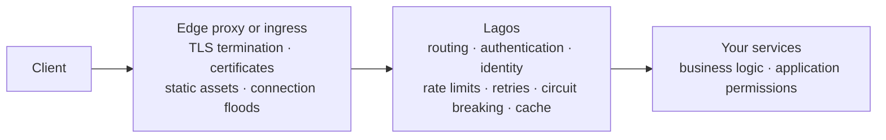
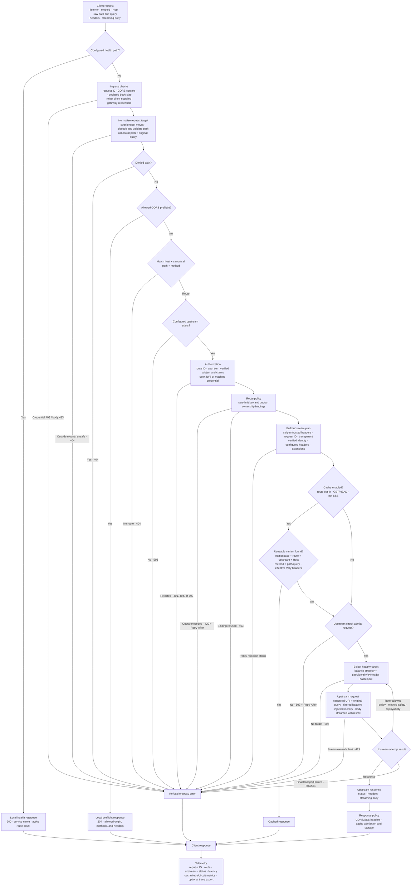

# Lagos

**A policy runtime for API traffic, built on
[Pingora](https://github.com/cloudflare/pingora).**

[](https://github.com/lagos-sh/lagos/actions/workflows/ci.yml)
[](LICENSE)

Pingora handles the transport — sockets, connection pools, HTTP/1 and HTTP/2,
upstream TLS. Lagos handles everything above it: who the caller is, which routes
they may reach, what the upstream is told about them, and what happens when a
backend is slow, unhealthy or gone.

It is an open-source API gateway written in Rust. It verifies JWT and Firebase
ID tokens, routes declaratively on host, path and method, and hands upstreams a
verified identity as headers or a signed token — so a service behind it never
needs an identity-provider SDK of its own.

It is **not** a web server or an edge proxy, and does not try to become one.
Lagos terminates no public TLS, serves no files and manages no certificates. It
runs behind whatever already faces the internet and takes over the decisions
that should not be living in that layer's annotations.

**One binary and one YAML file is a complete deployment.** No database, no
Redis, no control plane, no sidecar, no operator:

```bash
lagos run gateway.yml
```

> [!IMPORTANT]
> **Early development, pre-1.0.** Lagos has not been deployed in production or
> validated through load or soak testing. Configuration may change without a
> deprecation period before 1.0. Evaluate it in development and test environments;
> it is not yet recommended for production traffic. See [Project status](#project-status).

## Quick start: two files, no Rust

Start with `ghcr.io/lagos-sh/lagos:0.1.4`. The optional `lagos-builder` image
is used only to compile custom `ext/` policies; see
[Which Docker image should I use?](#which-docker-image-should-i-use).

Create an empty `myapp/` directory with these two files (or copy them from
[`examples/minimal/`](examples/minimal/)):

`Dockerfile`:

```dockerfile
ARG LAGOS_IMAGE=ghcr.io/lagos-sh/lagos:0.1.4
FROM ${LAGOS_IMAGE}
COPY gateway.yml /etc/lagos/gateway.yml
RUN ["lagos", "validate", "--allow-unset"]
```

`gateway.yml`:

```yaml
upstreams:
  users: ${USERS_URL:-http://host.docker.internal:3000}

routes:
  public:
    - prefix: /users
      upstream: users
      methods: [GET]
```

Build and run from `myapp/`:

```bash
docker build -t my-gateway .
docker run --rm -p 8080:8080 \
  --add-host=host.docker.internal:host-gateway my-gateway
```

`curl http://localhost:8080/health` should return gateway status. `GET /users`
is forwarded to a service on your host's port 3000. To try it without an
existing service, create a file named `users` in a temporary directory and
serve that directory on port 3000 with `python3 -m http.server`. Set `USERS_URL`
at `docker run` time when your service lives elsewhere, for example
`-e USERS_URL=http://users:3000` on a shared Docker network. The default URL
is for local development; the gateway's container cannot reach a host service
through `localhost`.

The image build checks the YAML before producing an image. An unset required
`${VAR}` is reported as *unchecked* by `--allow-unset`; the container still
refuses to start unless that value is supplied. Add routes and policy to this
same file. Split them into `routes.yml` only when the table becomes hard to
read. An `ext/` directory is not a supported drop-in mechanism: Rust
extensions require a custom binary today. See
[Architecture and extensions](#architecture-and-extensions).

For custom request policy, the optional [extension starter](examples/extension/)
adds an `ext/` folder. Lagos supplies a version-matched builder image that
compiles it into the gateway binary; see [Building with extensions](docs/extensions.md).

The 0.1.4 CLI provides `lagos init --docker` to
create the same two-file starter and `lagos init --docker --extensions` to
create the optional custom-code starter. Plain `lagos init` creates a minimal
YAML file for native use.

### Which Docker image should I use?

Lagos publishes two Docker images as separate packages on GitHub Container
Registry. **Use `lagos` for the standard YAML-only gateway.**

| Image | Purpose | When you need it |
|---|---|---|
| `ghcr.io/lagos-sh/lagos:0.1.4` | Small runtime image containing the gateway and CLI | Run the standard gateway, or use it as the final base image for a custom gateway |
| `ghcr.io/lagos-sh/lagos-builder:0.1.4` | Build image containing Rust, Cargo, matching Lagos source, and `lagos-build` | Compile or test custom Rust policy in an optional `ext/` directory |

An extension Dockerfile uses the builder to compile a custom executable, then
copies that executable into the runtime stage. Deploy the resulting application
image as one gateway container. The builder is used during builds and extension
tests; it does not run alongside the deployed gateway. Pin both image tags to
the same version; see [Building with extensions](docs/extensions.md).

Standalone macOS/Linux CLI binaries are downloads under GitHub Releases,
separate from these container packages; see [installation](docs/installation.md).

### Where the `lagos` command runs

The official image already contains the `lagos` binary and uses it as its
entrypoint. In the two-file setup, these commands run **inside Docker**; they
do not install anything on your machine:

```bash
docker run --rm my-gateway validate
docker run --rm -v "$PWD:/app" my-gateway test
docker run --rm -v "$PWD:/app" my-gateway diff old.yml gateway.yml
```

The last two commands read files from your current directory. `test` expects
`gateway.test.yml` beside `gateway.yml`. The `test` and `diff` commands require
version 0.1.4 or later; the 0.1.3 image does not include them.

Standalone Linux/macOS downloads and an automatic platform-detecting installer
are available starting with 0.1.4. Install the CLI without Rust
or Cargo; see [installation](docs/installation.md) for commands, version
pinning, checksums, and manual downloads. The release binary provides both
terminal commands and native serving. Docker commands above require no host
CLI installation.

For YAML completion and configuration feedback, see
[editor setup](docs/configuration-editor.md). The 0.1.4 CLI includes
`lagos schema` and `lagos schema --routes`; both also run inside Docker and
require no configuration or runtime secrets. Local builds support
`lagos init --docker --schema ./gateway.schema.json` after exporting a schema.

## Where Lagos sits

Lagos is one layer in a chain, not the whole edge:



The boundaries are deliberate, and they hold in both directions:

| Left of Lagos — an edge proxy's job | Lagos owns | Right of Lagos — your services' job |
|---|---|---|
| Public TLS termination, ACME, certificate rotation | Who the caller is and which routes they may reach | Application permissions and business rules |
| Static files, document roots, rewrite engines | What the upstream is told about that caller | Response shape and content |
| L4/stream proxying, connection flood handling | What happens when a backend is slow, unhealthy or gone | Persistence, transactions, side effects |

Anything that has to hold a certificate or serve content belongs on the left.
Anything that encodes what your product *means* belongs on the right. Lagos
keeps the middle, and keeping that middle small is the point: the entire policy
surface is one YAML file you can read in a sitting.

In practice: terminate TLS at nginx, Caddy, an ingress controller or a cloud
load balancer, and point it at Lagos. Lagos is ingress-agnostic — it watches no
Kubernetes resources and assumes no particular edge, so adopting it does not
mean replacing the one you have.

## Know what it will do before traffic arrives

A gateway is where authentication, routing and rate limiting stop being every
service's problem. That is the point of one — and it is also why a
misconfiguration here is quiet and total: nothing crashes, a route is simply
open, or a claim is simply never checked.

So Lagos treats *"what will this configuration actually do?"* as a question you
answer before deploying, not by reading logs afterwards:

```bash
lagos validate gateway.yml    # refuses to start on anything it cannot prove
lagos routes   gateway.yml    # the whole surface, tier by tier
lagos explain  --method GET --host api.example.com --path /users/42
lagos test     gateway.yml    # check your request-policy examples
lagos diff     old.yml gateway.yml # review the effective route surface
lagos dev      gateway.yml    # narrates every request as it is decided
```

`explain` answers for one specific request: which mount was stripped, which
route matched and why, which authentication tier it lands in, what the caller
will be asked to prove, and which upstream it reaches — without sending it.
`dev` prints the same reasoning live, per request.

Configuration is compiled once at startup into an immutable snapshot and swapped
atomically on reload, so a broken route file is rejected whole and the running
table keeps serving. Invalid configuration never half-applies.

## How Lagos handles a request

The diagram follows the runtime path from the client-visible HTTP request to a
local response, cached response, or selected upstream. Labels show the data
created or transformed at each stage.



All authorization decisions finish before cache lookup or upstream selection.
A cache hit therefore cannot bypass routing, authentication, rate limiting, or
ownership checks. The gateway records the final outcome in structured logs and
metrics; sampled requests also produce trace data.

## Contents

- [Where Lagos sits](#where-lagos-sits)
- [Know what it will do before traffic arrives](#know-what-it-will-do-before-traffic-arrives)
- [How Lagos handles a request](#how-lagos-handles-a-request)
- [Features](#features)
- [Quick start](#quick-start-two-files-no-rust)
- [Native use](#native-use)
- [Configuration](#configuration)
- [Authentication and identity](#authentication-and-identity)
- [Traffic management](#traffic-management)
- [Observability](#observability)
- [CLI reference](#cli-reference)
- [Deployment](#deployment)
- [Architecture and extensions](#architecture-and-extensions)
- [Development and testing](#development-and-testing)
- [Contributing](#contributing)
- [Project status](#project-status)
- [Roadmap](#roadmap)
- [Security](#security)
- [License](#license)

## Features

| Capability | What Lagos provides |
|---|---|
| JWT authentication | Verification against configured issuers and cached JWKS, with audience and algorithm checks |
| Firebase authentication | Firebase ID token verification across multiple projects using public signing certificates |
| Identity forwarding | Verified subject, issuer, mapped claims, and optional signed identity tokens for upstream services |
| Declarative routing | Path prefixes, host matching, allowed methods, authentication tiers, and internal route restrictions |
| Service-to-service access | Machine credentials on a separate internal listener |
| Load balancing | Weighted upstream pools with round robin, random, or consistent hashing and optional health checks |
| Traffic controls | Per-route rate limits, bounded retries, circuit breakers, request body limits, and configurable timeouts |
| Response caching | Opt-in memory cache with object limits, authorization checks, `Vary` handling, and route reload isolation |
| Streaming | Request and response streaming, including server-sent events (SSE) |
| Observability | Structured logs, Prometheus metrics, trace context propagation, and optional OTLP export |
| Developer tools | Configuration validation, route inspection, request explanation, and development reloads |
| Rust extensions | Custom request policies through the `lagos-core` library |

Lagos is designed for projects that want to centralize API authentication and
routing in front of HTTP services. Upstream applications can read gateway-issued
identity instead of integrating with every identity provider. They still need
to enforce their application-specific permissions and protect direct access to
endpoints that trust those headers.

### What Lagos owns, and what it does not

The split is deliberate, and it is why the project is small enough to reason
about:

| Pingora owns | Lagos owns |
|---|---|
| Sockets, connections, connection pooling | The routing model and how a request finds an upstream |
| HTTP/1 and HTTP/2, upstream TLS | Authentication tiers, identity forwarding, ownership bindings |
| Upstream communication, load-balancing primitives | Rate limits, retries, circuit breaking, caching policy |
| Proxy lifecycle hooks | Configuration lifecycle, validation and developer tooling |

Lagos is **not** a web server, an edge or TLS-terminating proxy, a service mesh,
a WAF, a CDN, an identity provider, a developer portal, or a Kubernetes ingress
controller. Nor is it an API composition layer: it does not merge, aggregate or
rewrite response bodies, and there is no transformation language — a gateway
that reshapes payloads has started holding business logic.

It decides *who may reach a route* and *what the upstream is told about them* —
not what may be sent through it. There is no request-body inspection and no
schema validation today; see [SECURITY.md](SECURITY.md) for the full list of
what is and is not enforced.

Extensions are Rust, compiled in. A WASM policy runtime is a plausible later
direction, but it is not implemented and the extension API is not stable enough
to freeze into one.

## Native use

### Install a release binary

Linux and macOS users can install a prebuilt `lagos` executable without a
compiler or language toolchain. Standalone downloads are available starting
with 0.1.4.

```sh
curl -fsSL https://github.com/lagos-sh/lagos/releases/latest/download/install.sh -o install-lagos.sh
sh install-lagos.sh
export PATH="$HOME/.local/bin:$PATH"
lagos --help
```

The installer supports Intel/AMD and ARM64 Linux, and Intel/Apple silicon
macOS 14+. It verifies checksums and installs to your user directory without
sudo or shell-profile edits. For pinned versions, other directories, and
manual archive installation, see [installation](docs/installation.md).

### Create a gateway configuration

Save this complete example as `gateway.yml`:

```yaml
server:
  listen: 127.0.0.1:8080

upstreams:
  users: http://127.0.0.1:3000

routes:
  public:
    - prefix: /users
      upstream: users
      methods: [GET]
```

Validate the configuration and start the gateway:

```bash
lagos validate gateway.yml
lagos run gateway.yml
```

From another terminal:

```bash
curl http://127.0.0.1:8080/health
curl http://127.0.0.1:8080/users
```

`/health` reports gateway status. `/users` forwards to the configured service,
so its response depends on that service being available. The route prefix is
preserved: `/users/42` is forwarded as `/users/42` (see
[Stripping a route prefix](#stripping-a-route-prefix) to remove it).

For a generated minimal configuration, run `lagos init` in a directory without
an existing `gateway.yml`. See [examples/gateway.yml](examples/gateway.yml) for
the full configuration reference. `lagos init --docker` creates a root-level
Dockerfile and Docker-specific `gateway.yml` instead.

## Configuration

The following YAML examples show settings to merge into `gateway.yml` unless
marked as complete configurations. Define every referenced service under
`upstreams`.

Configuration keys are validated, and unknown fields produce an error. Without
an explicit configuration path, the CLI checks `GATEWAY_CONFIG`, then
`gateway.yml`, `gateway.yaml`, and `config/gateway.yml`.

### Environment variables

Use `${VAR}` for a required value or `${VAR:-default}` for a fallback:

```yaml
upstreams:
  users: ${USERS_URL:-http://localhost:3000}

inject:
  headers:
    x-api-key: ${API_KEY}
```

An unset, empty, or whitespace-only required variable causes configuration
loading to fail. Write `$${` when a literal `${` is needed.

### Routes and authentication tiers

A route's group determines its authentication policy:

```yaml
routes:
  internal:
    - products/internal

  public:
    - prefix: /auth
      upstream: auth
      methods: [POST]

  optional:
    - prefix: /products
      upstream: products
      methods: [GET]

  authenticated:
    - prefix: /orders
      upstream: orders
```

| Group | No bearer token | Valid bearer token | Invalid or expired bearer token |
|---|---|---|---|
| `public` | Proxied without user identity | Token ignored by gateway authentication | Token ignored by gateway authentication |
| `optional` | Proxied anonymously | Proxied with verified identity | `401` |
| `authenticated` | `401` | Proxied with verified identity | `401` |
| `machine` | Requires a machine credential on the internal listener | User token does not establish machine identity | User token does not establish machine identity |

`internal` lists path prefixes denied on the public listener. It is not an
authentication tier. Denied and unallowlisted paths return the same `404`
response. Other refusals use the appropriate status, including `401` for user
authentication failures and `403` for ownership binding failures.

Path matching uses segment boundaries and the longest matching prefix within
host specificity. Omitting `methods` permits any method. Set `enabled: false`
to exclude a route from the active table.

### Host matching

```yaml
routes:
  public:
    - host: api.example.com
      prefix: /users
      upstream: users

    - host: ["*.preview.example.com", staging.example.com]
      prefix: /users
      upstream: users-staging
```

Routes without `host` match any host. Host-restricted routes take precedence
over unrestricted routes; matching ignores case and port. Wildcards require a
subdomain boundary, so `*.example.com` does not match `evilexample.com`.

Host matching selects routes; it does not authenticate callers. Restrict
internal access through the machine listener and network policy.

### Mount paths and route reloads

To serve both a versioned API prefix and paths at the root:

```yaml
server:
  mounts: [/api/v1, /]
```

The longest matching mount is removed before route matching. With the `/users`
route above, `/api/v1/users/42` and `/users/42` both forward as `/users/42`.

### Stripping a route prefix

A mount applies to every request. To remove a prefix for one route only — so
several services can share one hostname under their own prefixes while each
keeps serving from its root — set `strip_prefix`:

```yaml
routes:
  public:
    - prefix: /svc/users
      upstream: users
      strip_prefix: true   # /svc/users/42 → /42, /svc/users → /
    - prefix: /orders
      upstream: orders     # /orders/7 → /orders/7 (the default)
```

Only the path sent upstream changes. The deny-list, route matching, bindings,
cache keys, logs and metrics all use the full path, so `internal: [/svc/users/admin]`
still denies `/svc/users/admin/x` even though the upstream would have seen
`/admin/x`. The query string is forwarded unchanged, and a mount is removed
first, then the route prefix. `lagos explain` shows the path the upstream
receives, and `lagos test` can assert it with `expect.upstream_path`.

Routes can also live in a separate file:

```yaml
routes:
  file: routes.yml
  reload: 15s
```

The route file contains the route groups directly, without a `routes:` wrapper.
Use inline routes or a route file, not both. File changes are polled by
modification time; invalid route updates retain the previous table. Successful
reloads start a new cache namespace. Changes to the main configuration require
a restart, which `lagos dev` manages during development.

## Authentication and identity

### JWT authentication with JWKS

Configure the issuer, accepted audiences, signing key endpoint, and permitted
algorithms for each provider:

```yaml
auth:
  jwt:
    - issuer: https://auth.example.com
      audience: [my-api]
      jwks_url: https://auth.example.com/.well-known/jwks.json
      algorithms: [RS256]
      required_claims: [email]
```

Compatible JWT issuers can include Auth0, Microsoft Entra ID, Keycloak, Okta,
Amazon Cognito, or a custom identity provider. Use the issuer and JWKS URL
published for your application; endpoint paths vary by provider.

Lagos selects a configured verifier using the token's `iss` claim and then
verifies the signature and claims. Audience configuration is required. The
verifier checks expiration, requires a numeric `iat`, rejects an issuance time
beyond the configured clock skew, and validates `nbf` when present. Generic JWT
verification also requires a nonempty string `sub` and a signing-key `kid`.

The token's `alg` must appear in the configured algorithm list. Supported
algorithms are `RS256`, `RS384`, `RS512`, `ES256`, `ES384`, `PS256`, `PS384`,
`PS512`, and `EdDSA`. HMAC algorithms and `none` are not accepted for external
JWT verification. Duplicate issuer registrations fail startup.

Lagos verifies tokens issued elsewhere; it does not provide a login flow or
issue identity-provider access tokens.

### Firebase ID tokens

```yaml
auth:
  firebase:
    projects: [mobile-app, admin-app]
```

Firebase verification uses project IDs and Google's public signing
certificates. No service-account credentials or Firebase private keys are
needed. Checks include the signature, issuer, audience, expiration, issuance
time, authentication time, and subject. Token revocation is not checked.

Firebase and generic JWT providers can be configured together.

### Identity headers and signed tokens

After verification, Lagos describes the caller to the upstream:

```text
x-auth-subject: 4821
x-auth-issuer: https://securetoken.google.com/mobile-app
x-auth-claims: <base64url-encoded JSON claims>
```

Configured identity headers are stripped from client requests before gateway
values are set. Public routes receive no verified user identity.

For upstreams that also verify the gateway's assertion cryptographically,
configure a short-lived identity token:

```yaml
identity:
  token:
    header: x-auth-token
    secret: ${GATEWAY_IDENTITY_SECRET}
    ttl: 60s
    audience: internal

forward:
  authorization: false
```

The identity token uses `HS256`. Upstreams should verify its signature,
expiration, and configured audience with the shared identity secret.
`forward.authorization: false` stops forwarding the original caller credential;
its default is `true`.

### Claims and ownership

Map verified claims into individual headers:

```yaml
identity:
  claims:
    x-user-id: sub
    x-role: role
    x-team-id:
      claim: teamId
      when_null: none
```

| Claim value | Forwarded header |
|---|---|
| String, number, or boolean | Scalar value |
| Explicit JSON `null` | `when_null`, if configured; otherwise omitted |
| Absent | Omitted |
| Object or array | Request refused when the claim is mapped to a header |

Ownership bindings compare a request value with the verified identity:

```yaml
routes:
  authenticated:
    - prefix: /projects
      upstream: projects
      bind:
        query.projectId: identity.project_id
```

Bindings support `query.<name>` and `header.<name>` sources, compared with
`identity.subject`, `identity.sub`, or a claim path. Missing values, mismatches,
and duplicate bound parameters or headers return `403`. Query names and values
are decoded before comparison. Bindings complement the upstream's own
application authorization.

### Machine authentication

Service-to-service routes use a separate listener and shared credential:

```yaml
server:
  internal_listen: 127.0.0.1:8081

auth:
  machine:
    secret: ${MACHINE_SECRET}
    headers: [x-internal-api-key]

routes:
  machine:
    - prefix: /jobs
      upstream: jobs
```

Machine routes are absent from the public listener. Restrict network access to
the internal listener. Use `inject.machine` to configure credentials sent to
machine-tier upstreams independently of the public listener's `inject.headers`.

## Traffic management

### Upstream pools

A single URL configures one target. Multiple targets configure a pool:

```yaml
upstreams:
  orders:
    targets:
      - http://orders-1:3000
      - url: http://orders-2:3000
        weight: 3
    balance: round_robin
    health_check:
      path: /health
      interval: 10s
      unhealthy_after: 2
      healthy_after: 1
```

Available balancing strategies are `round_robin`, `random`, and `consistent`.
Consistent hashing supports `hash_on: path`, `identity`, `ip`, or `header.<name>`;
`path` is the default. IP hashing uses the socket peer, which may be an ingress
rather than the original client.

Health checks use HTTP when `path` is configured and TCP otherwise. Unhealthy
members leave the selection pool and rejoin after successful checks. If no
healthy member can be selected, Lagos returns `502`.
HTTP checks use each member's own Host header (including its port), scheme,
and TLS server name. Targets must resolve to distinct address-and-port pairs;
ambiguous duplicates prevent startup.

Pool discovery resolves configured targets at startup. A target that cannot be
resolved prevents startup. Pool membership is static; DNS-based membership
refresh is not provided. Review service discovery requirements before using
pools with changing backend addresses.

### Retries

```yaml
routes:
  authenticated:
    - prefix: /orders
      upstream: orders
      retry:
        attempts: 2
        on: [connection_failure, transport_error]
```

`attempts` counts retries after the initial attempt.

| Failure | Retry policy |
|---|---|
| Connection failure before delivery | Any method, when enabled and replayable |
| Eligible transport failure after connection | Idempotent methods by default, subject to Pingora's retry decision |
| Body no longer replayable | No retry |
| Upstream response status | Status-based retries are not supported |

`non_idempotent: true` permits eligible transport retries for methods such as
`POST` and `PATCH`; use it only when the upstream tolerates duplicate delivery.
Pool selection runs again on retry, but selection of a different backend is
not guaranteed.

### Circuit breaker

```yaml
upstreams:
  orders:
    url: http://orders:3000
    circuit_breaker:
      failures: 5
      window: 30s
      cooldown: 10s
      successes_to_close: 2
      max_trials: 1
```

Circuit breakers track upstream failures and temporarily stop new upstream
attempts. A closed circuit opens after the configured failure run. Following
the cooldown, a limited number of half-open trials determine whether it closes
or opens again. Shed requests receive `503` with `Retry-After`.

Only requests that need an upstream consume trials. Cache hits and local
refusals, such as rate limiting, do not count as upstream recovery. Health
checks assess individual backend availability; circuit breakers track outcomes
for the logical upstream.

### Rate limiting

```yaml
routes:
  authenticated:
    - prefix: /search
      upstream: search
      rate_limit:
        requests: 100
        interval: 1m
        key: identity
        counter: exact
```

Limits are per route and local to each gateway process. Exceeding a limit
returns `429` with `Retry-After`. Multiple gateway instances do not share quota.
Available keys are `ip`, `identity`, `route`, and `header.<name>`. If a configured
key cannot be determined, that request is not limited; choose a key present on
all requests that must be covered.

| Counter | Behavior |
|---|---|
| `exact` | Per-key sliding-window counters in a capacity-bounded cache; default `max_keys` is 100,000 |
| `sketch` | Fixed-memory count-min sketch; collisions can over-count and refuse a request below its own quota |

For IP limits, configure `trusted_proxies` inside the route's `rate_limit`
block. `0` uses the socket peer; `1` uses the last `X-Forwarded-For` entry;
`n` counts from the right. This setting must match the actual trusted proxy
chain. An excessive value can trust a client-supplied address.

### Response cache

```yaml
cache:
  max_size: 256MiB
  max_object_size: 8MiB
  default_ttl: 60s

routes:
  public:
    - prefix: /products
      upstream: products
      methods: [GET, HEAD]
      cache: true
```

Caching is opt-in per route. Lagos uses Pingora's cache lifecycle with a custom
memory store. Storage and eviction accounting include metadata costs, and
object size is checked during filling. Only complete objects are stored;
oversized responses continue downstream without being cached.

| Condition | Cache behavior |
|---|---|
| `Cache-Control: private` or `no-store` | Not stored or reused |
| Request contains `Authorization` | Reuse and storage require explicit permission in the response cache policy |
| Method other than `GET` or `HEAD`, or an SSE route | Bypasses caching |
| `Vary: *` or malformed `Vary` | Not reusable |
| Route has no `cache: true` | Bypasses caching |
| `4xx` or `5xx` without explicit caching instructions | Not cached by default |

An `optional` or `authenticated` route also requires
`cache_authenticated: true` to enable caching. This opt-in assumes the upstream
provides correct cache directives for personalized content.

Keys include host, method, path, query, route, upstream, and route table
generation. `Vary` selects variants using headers sent upstream, including
injected identity. A successful route reload starts a fresh namespace; old
entries remain subject to eviction.

### CORS

```yaml
cors:
  origins: [https://app.example.com, "https://*.preview.example.com"]
  methods: [GET, POST]
  headers: [content-type, authorization]
  expose: [x-request-id]
  credentials: true
  max_age: 10m
```

Lagos answers eligible preflight requests after route and deny-list checks,
before user authentication. Origin rules match the scheme, host, and port.
`credentials: true` with origin `*` fails configuration validation. Responses
that echo an allowed origin add `Vary: Origin` while preserving upstream
`Vary` fields.

### Client addresses and trusted proxies

Upstreams read the caller's address from `X-Forwarded-For` and `X-Real-IP`, and
use it for per-IP quotas, geo rules, fraud scoring, abuse blocklists and audit
trails. Anyone can send those headers, so the gateway decides how much of an
arriving chain to believe:

```yaml
forward:
  # Hops in front of this gateway that are yours. 0 = the gateway is the edge.
  trusted_proxies: 1
  # Socket peers allowed to supply those hops.
  trusted_proxy_ips: [10.1.2.3/32]
```

`X-Forwarded-For` is appended to by each hop, so entries run oldest-first and
only the **rightmost** ones were written by infrastructure you control. Lagos
counts from the right:

| `trusted_proxies` | Arriving chain | `X-Real-IP` sent upstream |
|---|---|---|
| `0` (default) | discarded | the socket peer |
| `1` | untrusted prefix removed, peer appended | the entry your one proxy appended |
| `2` | untrusted prefix removed, peer appended | one further left |

Set it to the number of hops that are genuinely yours — `1` behind a single
cloud load balancer or ingress controller, `2` behind a CDN in front of that.
`trusted_proxy_ips` must list their source IPs or CIDR ranges. Lagos ignores
XFF from any other socket peer, including a direct connection. The list is
required whenever forwarding or an IP rate limit trusts a proxy hop.
Use narrow ranges and restrict the listener to those proxies at the network
layer: any host allowed to connect from a listed address can supply XFF.
Set it too high and a client can forge its own address by padding the header;
leave it at `0` behind an ingress and every upstream sees the ingress address
instead of the caller.

`rate_limit.trusted_proxies` uses the same rule, and the two should agree —
throttling one address while telling the upstream about another makes a per-IP
control unenforceable. `lagos validate` prints which policy is in effect.

### Connection-level limits

Two controls act below HTTP, on the socket itself:

```yaml
server:
  # Detect a peer that vanished without closing, and release its socket.
  tcp_keepalive:
    idle: 60s
    interval: 10s
    count: 6

limits:
  # Refuse connections from an address opening them too fast. OFF by default.
  connections_per_ip:
    connections: 100
    interval: 1s
    max_tracked: 100000
```

`connections_per_ip` uses Pingora's `connection_filter`, which runs immediately
after `accept()` and before any TLS handshake — the only place a connection can
be refused before it costs a task, a buffer and a file descriptor. Refused
connections are dropped rather than answered: there is no request to refuse yet,
and a flood is not the moment to spend a response on every attempt.

It counts **accepts, not live connections** — the hook is never told about a
close, so a population count kept there would drift upward until it refused
everyone. The absolute header deadline closes connections that never finish a
request header. Long-lived responses can outlive it, so this is not a hard
concurrent-connection ceiling.

> [!WARNING]
> **Leave this off behind a load balancer or ingress.** Every connection then
> arrives from one address, and a per-address limit would throttle the entire
> gateway. It is the right control only where Lagos is the edge. A hard ceiling
> on concurrent connections still belongs at the layer in front, and in `ulimit`.

### Upstream name resolution

A single-target upstream keeps its hostname rather than an address, so a record
change is picked up without a restart. Names are resolved on the runtime's
blocking pool and cached:

```yaml
dns:
  cache_ttl: 30s    # 0s resolves on every request
  max_entries: 1024
```

`cache_ttl` is the delay before a record change is noticed, traded against a
resolver round trip per request. Failed lookups are never cached, so one bad
lookup cannot become a TTL-long outage for that upstream. An upstream written as
an IP literal skips resolution entirely. The connect timeout bounds DNS lookup;
multiple answers are rotated across requests and the next address is tried
when a connection fails before a request is delivered.

This matters more than it looks. Resolving with `getaddrinfo` on a proxy worker
thread — two of them by default — means a slow resolver does not slow the
gateway down, it stops it, and makes slow DNS an amplifier for anyone sending
traffic.

### Streaming and request limits

Set `sse: true` on an SSE route to use the SSE timeout and emit headers that
request intermediaries avoid response buffering. SSE routes bypass the cache.

`limits.max_body` applies to declared content lengths and streamed request body
bytes. Oversized requests return `413`. `limits.max_token` caps the bearer token
the gateway will look at — a token is base64-decoded, parsed and put through a
signature check before any identity-keyed limit can apply, so the length is
bounded first. The default is `8KiB`.

The `timeouts` block controls connection, normal request, upload, SSE, and
upstream idle timeouts. It also carries the **downstream** budgets, which bound
what one client connection can hold:

```yaml
timeouts:
  downstream_read: 30s        # absolute header deadline; body read-stall limit
  downstream_write: 30s       # a stalled write: a client that stops reading
  downstream_drain: 5s        # discarding the body of a request being refused
  downstream_keepalive: 60s   # idle connection reuse

limits:
  keepalive_requests: 1000    # requests per connection before it is closed; 0 = no limit
  min_send_rate: null         # bytes/sec a client must accept a response body at
```

Pingora leaves most of these unset, which for an edge gateway means unbounded:
a client that connects, sends a request a byte at a time, then reads the reply a
byte at a time costs the attacker one socket and holds a worker task plus an
upstream connection indefinitely. That is slowloris, and it needs no traffic
volume. SSE routes get `timeouts.sse` as their write budget instead, since an
event stream is a long-lived response by design.

`min_send_rate` is off by default. It turns into a write timeout scaled by how
much is being written — something a flat `downstream_write` cannot express, since
a large response legitimately takes longer than a small one. Turn it on where
responses are big enough that a slow reader is worth the memory it holds; leave
it off if real clients are on genuinely poor links.

See the [configuration types](crates/lagos-core/src/config/mod.rs) for every
field and default.

## Observability

### Metrics

Expose Prometheus metrics on a separate listener:

```yaml
observability:
  metrics:
    listen: 127.0.0.1:9090
```

| Metric | Purpose |
|---|---|
| `gateway_requests_total` | Request counts by route, method, and status |
| `gateway_request_duration_seconds` | Request latency by route |
| `gateway_rejections_total` | Gateway refusals by event and normalized reason |
| `gateway_upstream_errors_total` | Upstream errors |
| `gateway_retries_total` | Retry attempts |
| `gateway_pool_backends` | Healthy and unhealthy backend counts |
| `gateway_circuit_state` | Closed (`0`), half-open (`1`), or open (`2`) |
| `gateway_cache_total` | Cache outcomes by route |
| `gateway_spans_dropped_total` | Trace spans dropped from the export queue |
| `gateway_routes` | Configured route count |

Metric labels use configured identifiers or bounded categories. Request paths,
token subjects, and raw rejection details are not used as metric labels. Keep
the metrics listener accessible only to the intended monitoring infrastructure.

### Tracing

```yaml
observability:
  tracing:
    sample_ratio: 0.1
    otlp:
      endpoint: http://otel-collector:4318/v1/traces
```

Lagos continues incoming `traceparent` context with a new span for the gateway
hop. Missing or malformed context starts a new trace. `sample_ratio` applies to
new traces; incoming sampling decisions are preserved.

Omit `otlp` to propagate trace context without exporting spans. Export uses a
bounded, nonblocking queue; a full queue drops spans and records a metric rather
than waiting on the collector in the request path.

### Logging

Serving mode emits structured logs with request ID, route, upstream, response
status, latency, and retry information. `lagos dev` provides readable request
narration for local debugging. Lagos suppresses duplicate Pingora proxy error
logs and emits its own contextual failure records.

## CLI reference

| Command | Purpose |
|---|---|
| `lagos init [PATH]` | Generate a minimal native configuration; defaults to `gateway.yml` |
| `lagos init --docker` | Generate root-level `gateway.yml` and `Dockerfile`; refuses to overwrite either unless `--force` is passed |
| `lagos init --docker --extensions` | Generate the custom-code starter with `ext/Cargo.toml` and `ext/src/lib.rs` |
| `lagos init [--docker] --schema PATH_OR_URL` | Add an editor schema comment; official release images default to the matching versioned schema |
| `lagos schema [--routes]` | Write JSON Schema for gateway YAML or a standalone route file to stdout without loading configuration or extensions |
| `lagos config --effective [CONFIG]` | Show a redacted JSON view of resolved file/environment settings with provenance and unchecked inputs; unsuitable for deployment |
| `lagos vars [CONFIG]` | Inventory every environment reference with its state, default/required flags, and source line/column; values and default text stay hidden |
| `lagos validate [CONFIG]` | Validate configuration, routes, and extension references |
| `lagos validate --allow-unset` | The same checks where `${VAR}`s are not set, as in a container build |
| `lagos routes [CONFIG]` | Display routes and upstreams |
| `lagos explain --path PATH [--method METHOD] [--host HOST] [--config CONFIG] [--listener public\|internal] [--why-not]` | Explain route selection and configured policy; optionally list prefix candidates and refusal reasons |
| `lagos test [CONFIG] [CASES] [--allow-unset]` | Check request-policy examples; defaults to `gateway.test.yml` beside the config |
| `lagos diff OLD NEW [--allow-unset]` | Compare effective routes, deny-list, mounts, and upstream targets |
| `lagos dev [CONFIG]` | Serve with request narration and validated configuration reloads |
| `lagos run [CONFIG]` | Start the gateway |

For example:

```bash
lagos explain --method GET --host api.example.com --path /users/42
```

For unmatched requests, add `--why-not` to list prefix candidates and their host,
method, listener, or deny-rule exclusions. `--listener internal` examines machine
routes. Both options are available starting with 0.1.4; see
[route explanations](docs/route-explanations.md) for examples and unchecked work.

To inspect resolved typed settings with redaction, use `lagos config --effective`.
It describes this invocation's inputs and carries explicit unchecked state; see
[effective configuration](docs/effective-configuration.md) for the redaction policy
and Docker usage. This command is available starting with 0.1.4.

Use optional top-level `defaults:` to share route methods, retry policies, and
rate limits. Routes can replace each policy, explicitly disable retry/rate
limiting with `null`, or allow any method with `methods: []`. See
[route defaults](docs/route-defaults.md) for precedence, policy origins, and reload
behavior.

Before supplying environment variables, use `lagos vars` to see what the files
need; see [variable diagnostics](docs/configuration-vars.md) for Docker usage
and unchecked-file reporting. This command is available starting with 0.1.4.

Use `lagos --help` or `lagos <command> --help` for command options. Running
`lagos` without a subcommand starts serving with the discovered configuration.

### Test and review configuration changes

Put `gateway.test.yml` beside `gateway.yml`. A small test suite can prove that
an allowed request reaches the expected authentication tier and that a denied
path stays denied:

```yaml
tests:
  - name: catalogue is public
    request: { path: /users/42, method: GET }
    expect: { result: route, route: users, tier: public, upstream: users }
  - name: writes are not allowlisted
    request: { path: /users/42, method: DELETE }
    expect: { result: no_route }
```

Run `lagos test gateway.yml`. A failing expectation exits nonzero and names the
field that differed. For an ownership rule, supply `request.query`, optional
`request.headers`, and a synthetic `request.identity` with `subject` and
`claims`; `expect.bindings: true` or `false` checks all configured bindings.
`expect.upstream_path` checks the path the upstream receives, which differs
from the request path on a `strip_prefix` route.
`request.listener: internal` checks machine-tier routing. Other results are
`denied`, `outside_mount`, and `unsafe_path`.
Use `--allow-unset` in CI when deployment-only variables are unavailable; the
report names every value it could not check. As with `validate`, a boolean
route switch needs a real value or a default so the route table can be parsed.

These are offline routing and binding checks. The synthetic identity represents
a caller whose token was **already verified**; `test` does not verify JWTs,
execute extensions, contact upstreams, or simulate rate limits. Use end-to-end
tests for those behaviours.

`lagos diff old.yml new.yml` shows route additions, removals, tier and policy
changes, deny-list changes, mounts, and changed upstream definitions. It hides
upstream target values. It is a route-surface report, not a replacement for the
YAML diff: review auth providers, injected headers, listeners, and secrets in
the original files. `--allow-unset` can compare documents without production
environment values, and explicitly names any values it left unchecked.

### Where the configuration is found

With no path argument, these are tried in order, and `GATEWAY_CONFIG` overrides
all of them:

```
gateway.yml · gateway.yaml · config/gateway.yml · lagos/gateway.yml
deploy/gateway.yml · /etc/lagos/gateway.yml
```

Relative `routes.file` paths are resolved beside the document that names them,
so a configuration directory moves as a unit. Use an absolute path for a route
file elsewhere. `/etc/lagos` is last, which lets a `gateway.yml` mounted over
the working directory override one baked into an image.

### Validating without an environment

`validate` treats an unset `${VAR}` that has no default as fatal, the same way
`run` does. That is the right default everywhere traffic is served, and the
wrong one inside `docker build`, where none of the production environment
exists yet.

`--allow-unset` expands those variables to distinct placeholders and checks
everything that does not depend on their values — syntax, route ids and tiers,
ambiguous same-prefix matchers and cross-tier overlaps, upstream references,
and the CORS and cache startup refusals — then lists what it could not check:

```console
$ lagos validate --allow-unset
✓ syntax
✓ routes      2  (2 public)
✓ environment ORDERS_URL, CARTS_URL

  using defaults for: CARTS_URL

  NOT checked, unset and left as a placeholder: ORDERS_URL, PUBLIC_HOST
  Structure was checked; the values these feed were not. Give one a
  default (`${NAME:-value}`) to have it checked here too.

lagos/gateway.yml is structurally valid (2 unset).
```

A declared default always wins over the placeholder, so `${PORT:-8080}` is
checked as `8080` rather than skipped. Variables that land in numeric or boolean
fields still fail to parse — the fix is to give them a default, which makes the
field checkable at build time.

The route file must have a known path at build time. If `routes.file` uses an
unset variable, give it a default such as `${ROUTES_FILE:-routes.yml}` so
`validate` can read and check the file.

The flag is offered to `validate` alone. A gateway that started with a
placeholder where a credential or an upstream belongs would be worse than one
that refused to start, so `run` and `dev` do not accept it.

## Deployment

### Docker

Build the image from the repository:

```bash
docker build -t lagos:local .
```

Use a deployment configuration that listens on `0.0.0.0:8080` and points to
upstream addresses reachable from inside the container. The quick-start
loopback addresses are intended for a native local process.

```bash
docker run --rm -p 8080:8080 \
  --mount "type=bind,src=$(pwd)/gateway.yml,dst=/app/gateway.yml,readonly" \
  lagos:local
```

### Building your own image

Extend the published image and copy the root configuration into
`/etc/lagos`, which is one of the locations searched when no path is given:

```
myapp/
├── Dockerfile
└── gateway.yml
```

```dockerfile
ARG LAGOS_IMAGE=ghcr.io/lagos-sh/lagos:0.1.4
FROM ${LAGOS_IMAGE}
COPY gateway.yml /etc/lagos/gateway.yml
RUN ["lagos", "validate", "--allow-unset"]
```

Use `lagos:local` in place of the published image to build against the one you
built above.

The `RUN` line makes a broken configuration fail `docker build` rather than the
deploy. It must be in exec form: the runtime image is distroless and has no
shell for the usual `RUN lagos ...`. If you later split routes into a separate
`routes.yml`, add `COPY routes.yml /etc/lagos/routes.yml` before `RUN`; relative
route paths are resolved beside `gateway.yml`.

This path covers a deployment whose policy is entirely declarative. For custom
[extensions](#architecture-and-extensions), use the
[`ext/` starter](docs/extensions.md) and matching `lagos-builder` image to
compile your application binary, then copy it into the runtime stage.

The image uses a distroless Debian runtime and runs as a nonroot user. Pass any
required configuration environment variables to the container. Mount separate
route files at their configured paths when using file-based routes.
For Docker Compose and Kubernetes integration, see the
[two-file deployment guide](docs/deploying.md).

### Listeners and graceful shutdown

The stock binary exposes HTTP listeners only. Terminate public TLS at an ingress
or another proxy — see [Where Lagos sits](#where-lagos-sits) — and restrict
direct access to upstreams that trust injected identity. HTTPS upstream targets
are supported.

`server.graceful_shutdown` defaults to `25s`. Configure the surrounding process
manager or Kubernetes termination grace period to allow that drain to finish.
Keep internal and metrics listeners restricted to their intended networks.

## Architecture and extensions

### Request lifecycle

1. Answer the health endpoint locally, or check gateway-owned client
   credentials and the declared request body size.
2. Remove the matching mount and canonicalize the path.
3. Apply the deny-list, then match an allowed route and method.
4. Verify user or machine credentials required by the route.
5. Apply rate limits, ownership bindings, identity policy, and extensions.
6. Check cache eligibility and reuse a matching response when permitted.
7. Check the circuit, select an upstream, apply the header plan, and proxy.

Authorization decisions are centralized in `request_filter`. Availability
checks occur when an upstream is needed. Incoming headers use allowlist
forwarding by default, with structural headers retained and gateway-controlled
values applied explicitly. `forward.mode: passthrough` is an explicit alternative.

### Path canonicalization

Lagos decodes percent-encoded paths before authorization, rejects dot segments,
backslashes, control characters, and unresolved percent escapes, then re-encodes
path segments for forwarding. The same canonical path is used for route policy
and upstream request construction. See [path.rs](crates/lagos-core/src/path.rs).

### Repository layout

| Path | Purpose |
|---|---|
| [`crates/lagos`](crates/lagos) | Stock CLI and gateway binary |
| [`crates/lagos-core`](crates/lagos-core) | Gateway library and policy implementation |
| [`crates/lagos-core/src/auth`](crates/lagos-core/src/auth) | JWT, Firebase, and signing-key verification |
| [`crates/lagos-core/src/routes`](crates/lagos-core/src/routes) | Routing, listener partitioning, and route providers |
| [`crates/lagos-core/src/cache`](crates/lagos-core/src/cache) | Cache policy, storage, and memory accounting |
| [`examples/gateway.yml`](examples/gateway.yml) | Configuration examples |
| [`tests/e2e`](tests/e2e) | Local upstream fixtures and integration checks |
| [`SECURITY.md`](SECURITY.md) | Vulnerability reporting policy |

### Extensions

Custom gateway binaries link `lagos-core`, implement the
[`Extension` trait](crates/lagos-core/src/ext.rs), and register extensions before
calling the CLI or runtime. The stock binary has no custom extensions registered.
The [extension starter](docs/extensions.md) provides a pinned builder image and
generates the entrypoint for an optional `ext/` crate.

Routes refer to registered extensions by name:

```yaml
routes:
  authenticated:
    - prefix: /workspaces
      upstream: workspaces
      extensions: [workspace-context]
```

An extension can inspect verified identity and construct a header plan:

```rust
use async_trait::async_trait;
use lagos_core::{Extension, ExtensionContext, Rejection};

struct WorkspaceContext;

#[async_trait]
impl Extension for WorkspaceContext {
    fn name(&self) -> &'static str {
        "workspace-context"
    }

    async fn on_request(&self, cx: &mut ExtensionContext<'_>) -> Result<(), Rejection> {
        let subject = cx.require_identity()?.subject.clone();
        cx.plan.set("x-verified-user-id", subject);
        Ok(())
    }
}
```

`plan.set()` replaces any client-supplied copy of that header. Missing extension
registrations fail startup; requests referencing an unavailable extension fail
closed.

### Route providers

The [`RouteProvider` trait](crates/lagos-core/src/routes/mod.rs) supplies route
tables independently of the proxy lifecycle. Lagos includes inline and YAML
file providers. Custom providers can integrate other configuration sources;
a Kubernetes `Ingress` or `HTTPRoute` controller is not included.

## Development and testing

Run the gateway directly from the checkout:

```bash
cargo run --bin lagos -- validate gateway.yml
cargo run --bin lagos -- dev gateway.yml
```

Run the checks used by [CI](.github/workflows/ci.yml):

```bash
cargo fmt --all -- --check
cargo clippy --workspace --all-targets -- -D warnings
cargo test --workspace
cargo check -p lagos-core --no-default-features
./tests/e2e/run.sh
```

The end-to-end suite requires Bash, Python 3, OpenSSL, curl, and a local build
environment. It starts local gateway, identity-provider, and upstream fixtures;
the full suite also runs [regressions.py](tests/e2e/regressions.py).

Coverage includes token forgery, path traversal, route isolation, duplicate
ownership parameters, cache variants and authorization, memory accounting,
retry behavior, circuit recovery, health checks, SSE streaming, and hot reloads.

The `lagos-core` library enables the `cache` and `otel` features by default.
Custom binaries can disable its default features and opt into either feature
individually. The stock `lagos` crate uses the library's default features.

## Contributing

Bug reports, documentation improvements, regression tests, and implementation
changes are welcome.

1. For non-security bugs, open an [issue](https://github.com/lagos-sh/lagos/issues)
   with a minimal reproduction, expected behavior, observed behavior, and a
   configuration with secrets removed.
2. Keep changes focused and add regression coverage for behavior changes.
3. Run the checks in [Development and testing](#development-and-testing).
4. Open a [pull request](https://github.com/lagos-sh/lagos/pulls) explaining the
   change and how it was validated.

Use the private reporting process below for suspected vulnerabilities.

## Project status

Lagos is an early-stage, pre-1.0 project. The current test suites include 251
unit tests, 134 end-to-end cases, and 38 additional regression checks. These
checks verify specific behavior; they do not establish production readiness.

- No production deployment has been reported by the project.
- Load and soak testing have not been completed; no throughput or latency
  benchmark claims are made.
- The configuration format may change without a deprecation period before 1.0.
- Memory limits are covered by implementation checks and tests, but have not
  been validated under sustained production traffic.

## Roadmap

[ROADMAP.md](ROADMAP.md) records what is being worked toward and what is
deliberately out of scope — including the items that most often come up as
missing: distributed rate limiting, OpenAPI import, traffic splitting, and a
control plane that would never sit on the request path.

What already works is in [Features](#features) above.

## Security

Behaviour changes between releases — including the ones that need a
configuration line to preserve existing behaviour — are recorded in
[UPGRADING.md](UPGRADING.md). Read it before moving a deployment forward.

Report suspected vulnerabilities privately through
[GitHub security advisories](https://github.com/lagos-sh/lagos/security/advisories/new).
Do not include exploit details or credentials in public issues.

Read [SECURITY.md](SECURITY.md) for scope, supported versions, response
expectations, and disclosure policy. During pre-1.0 development, only `main`
is supported.

## License

Copyright 2026 ThinkGrid Labs. Lagos is licensed under the
[Apache License 2.0](LICENSE); see [NOTICE](NOTICE) for the attributions a
redistribution must carry.
