# Lagos

An identity-aware HTTP gateway built on [Pingora](https://github.com/cloudflare/pingora).

> [!WARNING]
> **Early development.** Lagos has never run in production and has had no load
> or soak testing. The configuration format is not stable and will change
> without a deprecation path until 1.0. It is tested — 239 unit tests, 129
> end-to-end cases and 38 filter-interaction regression checks — but tests are not
> the same as traffic. Try it, read it, tell me where it is wrong; do not put
> customer traffic behind it yet.

Lagos verifies caller identity **once**, at the edge, and hands downstream
services a request they can trust. Services behind it need no knowledge of the
identity provider, no SDK, and no token-verification code — they read who the
caller is from headers the gateway guarantees no client can forge.

What it routes, what it refuses, and what it injects are entirely declarative.
Anything deployment-specific is an extension.

<p align="center">
  
</p>


## Why

The usual options for this job are a hand-written BFF (fine, until it is
buffering 50 MB uploads in a garbage-collected heap) or Envoy with an
`ext_authz` sidecar (an extra network hop and a second thing to operate).
Lagos is a single static binary that streams bodies, holds no private
keys, and keeps its whole authorization surface in one auditable file.

**Any OIDC issuer works** — Auth0, Entra, Keycloak, Okta, Cognito, or your own
— and several can be configured at once, with each token routed to its issuer.
Firebase is supported as a provider in its own right, including multi-project
verification, and needs **project IDs only**: verifying an ID token requires no
service-account credentials, so unlike the Firebase Admin SDK the gateway
stores no private key for any tenant.

## Design

| Concern | Where | Notes |
|---|---|---|
| Path canonicalization | [`path.rs`](crates/lagos-core/src/path.rs) | Full multi-pass percent-decode, then reject dot-segments, backslashes, control chars, and leftover `%` |
| Route table | [`routes/`](crates/lagos-core/src/routes/) | Deny-list, allowlist, longest-prefix wins, auth tier derived from the group |
| Token verification | [`auth/`](crates/lagos-core/src/auth/) | RS256 against cached Google certs; `iss`/`aud`/`exp`/`iat`/`auth_time`/`sub` |
| Header policy | [`headers.rs`](crates/lagos-core/src/headers.rs) | Allowlist forwarding, XFF chain, credential injection |
| Identity injection | [`identity.rs`](crates/lagos-core/src/identity.rs) | Identity headers + optional signed per-request token |
| Extension seam | [`ext.rs`](crates/lagos-core/src/ext.rs) | Deployment policy, named per route |
| Proxy lifecycle | [`proxy.rs`](crates/lagos-core/src/proxy.rs) | The `ProxyHttp` impl; 504 vs 502 on upstream failure |

Two invariants make this auditable:

1. **Every authorization decision happens in `request_filter`.** Route,
   identity and ownership policy are decided there. Availability checks such
   as circuit breaking run only when a request needs an upstream.
2. **Refusals are always `404`, never `403`.** A distinguishable response would
   let a caller enumerate the deny-list and learn which internal services exist.
3. **Client headers are dropped unless allowlisted.** An upstream can only
   receive a header because the configuration says so, never because a client
   sent one.

## Authentication

Any provider that signs JWTs and publishes a JWKS:

```yaml
auth:
  jwt:
    - issuer: https://auth.example.com
      audience: [my-api]
      jwks_url: https://auth.example.com/.well-known/jwks.json
      algorithms: [RS256]
      required_claims: [email]
```

Auth0, Entra, Keycloak, Okta, Cognito, an in-house issuer — verification uses
public keys only, so the gateway stores no secret for any of them.

Several issuers can be configured at once and a token is routed to one by its
`iss` claim, which is what lets a single gateway serve a customer tenant, a
staff tenant and a third-party IdP together. Two providers claiming the same
issuer is a startup error rather than an arbitrary winner.

**`audience` is required.** Without it, a token the same issuer minted for a
*different* service would be accepted here.

**The `alg` header never selects its own verification.** It is chosen by
whoever made the token, so it is checked against the configured `algorithms`
before any key is fetched. The HMAC family and `none` are not accepted at all
on this path: verification uses a public key, and treating one as a shared
secret is the classic algorithm-confusion attack.

### Firebase

Firebase is one provider among these rather than a special case, and keeps its
own block because Google publishes certificates in its own format rather than
as a JWKS:

```yaml
auth:
  firebase:
    projects: [customer-prod, merchant-prod, staff-prod]
```

Multi-project verification works out of the box, routed by the token's `iss`.
It needs **project IDs only**: verifying an ID token requires no service-account
credentials, so unlike the Firebase Admin SDK the gateway stores no private key
for any tenant.

## Identity

The point of the gateway. Once it verifies a caller, it describes them to the
upstream in headers — and strips any client-supplied copy first, so a caller can
never assert its own identity:

```
x-auth-subject: 4821
x-auth-issuer:  https://securetoken.google.com/my-project
x-auth-claims:  eyJhdWQiOiJwZXRzb2NhcmUtcHJvZCIsInVzZXJfdHlwZSI6IlYi...   (base64url JSON)
```

A service reading those needs no identity-provider SDK. But header injection
alone means the service is trusting *the network*: anything that can reach it
can claim to be any user. Add a signed token and it is trusting a signature
instead:

```yaml
identity:
  token:
    header: x-auth-token
    secret: ${GATEWAY_IDENTITY_SECRET}
    ttl: 60s
    audience: internal
```

```ts
const claims = verify(req.headers['x-auth-token'], SECRET, {
  algorithms: ['HS256'], audience: 'internal',
});
```

One local verification, no round trip to the identity provider. Set
`forward.authorization = false` to stop relaying the original credential once
upstreams no longer verify it themselves.

### Path canonicalization

The deny-list is enforced by string prefix matching, but the URI finally sent
upstream is normalized by the HTTP stack. If a matched string still contained
`%2e%2e`, a caller could match a public route and have the request resolve to a
denied internal path. Lagos fully decodes first (defeating `%252e`-style
multi-encoding), rejects anything containing a dot-segment, and re-encodes per
segment on the way out. See the [tests](crates/lagos-core/src/path.rs).

### Extensions

Route files name extensions; the lagos runs them after authentication and
before the upstream is chosen:

```json
{
  "id": "pos",
  "publicPrefix": "pos",
  "upstream": "pos",
  "methods": ["GET", "POST"],
  "extensions": ["pos-actor-context"]
}
```

```rust
#[async_trait]
impl Extension for PosActorContext {
    fn name(&self) -> &'static str { "pos-actor-context" }

    async fn on_request(&self, cx: &mut ExtensionContext<'_>) -> Result<(), Rejection> {
        cx.plan.strip("x-pos-permissions");           // never trust the client
        let identity = cx.require_identity()?;
        cx.plan.set("x-cashier-user-id", identity.subject.clone());
        Ok(())
    }
}
```

`plan.set()` also strips any client-supplied copy of the header, so an injected
value cannot be smuggled past. A route naming an unregistered extension **fails
the boot** — a typo can never silently skip a security control.

### Route providers

Routes come from a [`RouteProvider`](crates/lagos-core/src/routes/mod.rs).
`FileRouteProvider` ships today and reloads on mtime change (which is how a
Kubernetes ConfigMap update surfaces). The same trait accepts a provider that
watches `Ingress`/`HTTPRoute` resources and pushes a table on each reconcile —
the proxy path does not change.

mtime polling rather than SIGHUP is deliberate: Pingora reserves SIGHUP for
zero-downtime binary upgrades.

## Layout

| Crate | Purpose |
|---|---|
| `lagos-core` | The gateway library. Generic, no tenant concepts. |
| `lagos` | Stock binary: everything declarative, no extensions compiled in. |
| *your own crate* | Your deployment's policy plus its binary. See [Extensions](#extensions). |

## Configuration

One YAML document describes the whole gateway. The smallest one that works
needs no environment at all:

```yaml
upstreams:
  users: http://localhost:3000

routes:
  public:
    - prefix: /users
      upstream: users
```

```bash
lagos init          # writes a starter gateway.yml
lagos validate      # check it without serving
lagos routes        # print the table the matcher sees
lagos dev           # serve, narrate every request, reload on change
lagos run           # serve
```

`${VAR}` reads the environment and is **fatal if unset**; `${VAR:-default}`
falls back. That is the only indirection mechanism — there is no `*_env` field
to learn — so the same file runs on a laptop and in a cluster:

```yaml
upstreams:
  users: ${USERS_URL:-http://localhost:3000}

inject:
  headers:
    x-api-key: ${API_KEY}          # no default: unset means the gateway
                                   # refuses to start
```

A variable set to an empty or whitespace-only value counts as unset. `API_KEY=`
in a manifest is a mistake, not a deliberate empty credential; accepting it
would inject a blank header and hand every upstream an unauthenticated request.

Routes are grouped by auth tier, so a route cannot accidentally be declared
public — the tier comes from the group, never from a field on the route:

```yaml
routes:
  # Refused outright on the public listener, whatever else matches.
  internal:
    - loyalty/wallets
    - products/internal

  public:
    - { prefix: /auth, upstream: auth, methods: [POST] }

  optional:
    - { prefix: /products, upstream: products, methods: [GET] }

  authenticated:
    - { prefix: /loyalty, upstream: loyalty }     # no `methods` means any
```

| Tier | No token | Valid token | Invalid or expired token |
|---|---|---|---|
| `public` | proxied | proxied, token **ignored** | proxied, token ignored |
| `optional` | proxied, anonymous | proxied **with identity** | **401** |
| `authenticated` | **401** | proxied with identity | **401** |

`optional` is for anything usable signed-out but better signed-in — a catalog
that shows member pricing, a listing that marks favourites. Without it you get
one of two bad outcomes: make the route `authenticated` and signed-out users
cannot browse at all, or make it `public` and a signed-in user is
indistinguishable from an anonymous one.

The 401 on a stale token is deliberate. Silently serving anonymous content to a
caller who *thinks* they are signed in produces the worst kind of bug report
("my discount disappeared sometimes"). If a route must never fail for a
signed-out visitor, leave it `public` and let the upstream decide what to do
with the forwarded token.

**Identity headers are stripped on every tier before being set**, so a
`public`-tier request can never carry `x-auth-subject` upstream, no matter what
the client sends.

Routes can live in a file of their own when they change on a different schedule
from the rest — a ConfigMap operators edit without touching listeners or
credentials. Only that file is re-read on the reload interval:

```yaml
routes:
  file: routes.yml
  reload: 15s
```

Every key is checked: a misspelled field is a startup error naming the line and
listing what was expected, never a silently ignored policy.

### Host matching

```yaml
routes:
  public:
    - host: api.example.com
      prefix: /users
      upstream: users

    - host: ["*.preview.example.com", staging.example.com]
      prefix: /users
      upstream: users-staging
```

Omit `host` and a route serves every host. A host-specific route wins over a
catch-all at the same prefix, whatever order they are written in. Matching is
case-insensitive, requires the dot boundary for a wildcard (`evilexample.com`
does not match `*.example.com`), and **ignores the port** — the same service is
:8080 in a pod and :443 at the edge, so matching on it would make the route file
environment-specific.

> **This is routing, not authorization.** The `Host` header is chosen by the
> client, so `host:` keeps honest traffic apart — it does not keep anyone out.
> Anyone who can reach the listener can send any `Host` they like. Where a route
> must be unreachable from the internet, put it in the `machine` group so it
> binds to the internal listener, or deny-list it. Those are topology, which a
> header cannot argue with.

`lagos explain --host api.example.com --path /users/1` shows which route a
given host actually selects.

### Retries

```yaml
authenticated:
  - prefix: /orders
    upstream: orders
    retry:
      attempts: 2                    # retries after the first, so 3 in total
      on: [connection_failure]
```

A retry is only safe when the upstream did not process the first attempt, so
the decision turns on *where* the failure happened, not on how it looked:

| failure | upstream saw the request? | retried |
|---|---|---|
| could not connect | no | **any method** |
| error on an established connection | possibly | **idempotent methods only** |

[RFC 9110] makes GET, HEAD, OPTIONS, TRACE, PUT and DELETE idempotent. POST and
PATCH are never retried after a connection was established unless
`non_idempotent: true`, which asserts the upstream tolerates receiving the same
request twice — a claim about that service, not about the gateway. Get it wrong
on a payment and the retry is a second charge.

A request whose body has already been streamed past the point it can be replayed
is never retried either: re-sending with a truncated body delivers a corrupt
request, which is worse than the failure it was papering over.

With a pool, Pingora re-runs upstream selection on each retry, so an attempt
that failed to connect lands on a **different backend**.

**Retrying on a status code is not supported**, and saying `on: [502]` is a
startup error rather than a silent no-op. Deciding after a status arrives means
holding the whole response before forwarding any of it, which would break
streaming and server-sent events. Use `health_check` on the pool instead: a
failing backend leaves the rotation, which solves the same problem without
buffering anything.

[RFC 9110]: https://www.rfc-editor.org/rfc/rfc9110#name-idempotent-methods

### CORS

```yaml
cors:
  origins:
    - https://app.example.com
    - "https://*.preview.example.com"
  methods: [GET, POST]
  headers: [content-type, authorization]
  expose: [x-request-id]
  credentials: true
  max_age: 10m
```

Preflights are answered by the gateway and never reach an upstream. They are
answered **before authentication** — a browser sends no credentials on a
preflight, so requiring a token would break every cross-origin call to a
protected route at the first hop.

CORS is enforced by the browser, which makes a loose configuration a real
vulnerability rather than a cosmetic one. Three things are decided here rather
than left to the operator:

- **`credentials: true` with origin `*` is refused at startup.** Browsers reject
  the combination anyway, but the intent behind it — let any site make
  authenticated calls — is exactly what a naive echo implementation delivers.
- **An echoed origin always sets `Vary: Origin`.** Without it a shared cache can
  hand one origin's allowance to another, re-opening the hole.
- **Origins match whole**, on scheme, host and port. `https://evil-example.com`
  cannot satisfy a rule for `https://example.com`, and `https://*.example.com`
  requires the dot, so `evilexample.com` does not match.

Every response to a given origin carries the same cross-origin headers,
refusals included. That is load-bearing: a deny-listed path and an unknown one
both answer 404 so the deny-list cannot be enumerated, and if one carried
`Access-Control-Allow-Origin` while the other did not, a page could tell them
apart.

### Rate limiting

Per route, counted in this process:

```yaml
authenticated:
  - prefix: /search
    upstream: search
    rate_limit:
      requests: 100
      interval: 1m
      key: identity          # ip | identity | route | header.<name>
```

Over the limit is a **429** carrying `Retry-After`, so a throttled client is
told when to come back instead of retrying immediately — which is the thing the
limit exists to prevent.

Counters are local. That is a deliberate default: no Redis, no clock sync, no
network hop on the request path. The cost is that 100/min across three
instances admits up to 300/min, which for shielding an upstream from runaway
clients is usually the right trade.

```yaml
rate_limit:
  requests: 100
  interval: 1m
  counter: exact        # exact (default) | sketch
```

Both backends use the same sliding-window formula, so a limit means the same
thing either way. They differ in what they trade:

| | memory | accuracy |
|---|---|---|
| `exact` | one counter per key, capacity-bounded | a 429 is always the caller's own doing |
| `sketch` | fixed, whatever the key cardinality | **over-counts on collision** — one caller can be refused for another's traffic |

`sketch` is `pingora-limits`, a lock-free count-min sketch. Reach for it when
the key space is huge and the limit is a blunt abuse control; stay on `exact`
when the 429 is a promise to a named customer.

The algorithm is a sliding window counter — two integers per key. Unlike a
fixed window it cannot be gamed by spending a full quota either side of a
boundary; the previous window is weighted by how much of it is still in view,
so the quota is released gradually. Keys come from requests, so the store is
capacity-bounded (`max_keys`, default 100,000) and idle keys expire.

#### `trusted_proxies` is a security setting

```yaml
rate_limit:
  key: ip
  trusted_proxies: 1        # how many proxies actually front this gateway
```

`X-Forwarded-For` is appended to by each hop, so entries are oldest-first and
**only the rightmost ones are trustworthy** — everything further left was
supplied by the client. The count says how many entries to trust, from the
right:

| value | client address taken from |
|---|---|
| `0` (default) | the socket peer; nothing in the header is believed |
| `1` | the last `X-Forwarded-For` entry, appended by the one proxy in front |
| `n` | the *n*th entry from the right |

Taking the *first* entry — the obvious-looking choice, and what a "real client
IP" helper usually gives you — would let a caller mint a fresh quota per forged
address. The default of `0` is safe but means every client behind an ingress
shares one bucket, so set it to the number of hops that really are in front.

Set it too high and the gateway reads a client-supplied entry. It is a claim
that *n* proxies always front the gateway: if the pod is reachable directly as
well as through the ingress, that claim is false and the key is spoofable.

### Tracing

```yaml
observability:
  tracing:
    sample_ratio: 0.1
    otlp:
      endpoint: http://otel-collector:4318/v1/traces
```

The gateway *participates* in a trace rather than relaying one. Forwarding
`traceparent` untouched — the obvious thing, and what a header allowlist does by
default — makes the upstream's span a child of the **client's** span, so the
gateway never appears in the trace and every millisecond it adds is attributed
to the service behind it. Instead an incoming context is continued: the trace id
and sampling flags are kept, and a fresh span id for this hop is sent upstream.

A request arriving with no context starts one. A malformed `traceparent` starts
a fresh trace rather than failing the request — a broken trace must never break
traffic.

Omit `otlp` to propagate context without exporting anything, which is what you
want when the upstreams do their own collection.

`sample_ratio` applies only to traces the gateway *starts*. A request that
arrives with a sampling decision keeps it, whatever the ratio says —
re-deciding partway through produces a trace with holes in it.

**A collector outage is never a traffic outage.** Finished spans go to a bounded
queue with a non-blocking send; a background task does the exporting. If the
queue fills, spans are dropped and counted in `gateway_spans_dropped_total`. An
unbounded queue would turn a dead collector into memory exhaustion, and blocking
on the send would turn it into an outage — losing visibility is the right thing
to lose.

Export can be compiled out entirely with `--no-default-features`; propagation
still works, and the binary carries none of the OpenTelemetry dependency tree.

### What the gateway does *not* log

Pingora logs proxy failures itself, and so does this gateway — with the request
id, route, upstream, peer, retry count and latency attached. Both would double
the log volume during an incident, exactly when volume hurts most, so Pingora's
own error and retry-warning logs are suppressed and the gateway's line carries
everything they had.

### Metrics

```yaml
observability:
  metrics:
    listen: 0.0.0.0:9090
```

On a listener of its own, never the traffic port — route names and upstream
health are operator information, not something to hand anyone who can reach the
gateway.

```text
gateway_requests_total{route,method,status}
gateway_request_duration_seconds{route}
gateway_rejections_total{event,reason}
gateway_upstream_errors_total{upstream}
gateway_pool_backends{upstream,state}
gateway_routes
```

**Every label is bounded by configuration, never by request content.** A
Prometheus label fed from a request is a memory-exhaustion bug with extra
steps: each distinct value allocates a permanent time series, so a client that
can invent label values can grow the process without bound. Paths, request ids,
user ids and token subjects are therefore never labels — and because a client
chooses its own HTTP method, anything outside the known verbs is recorded as
`OTHER` rather than as itself.

### Upstream pools

A bare URL is one backend. Several make it a pool, with weights, a balancing
algorithm and health checking:

```yaml
upstreams:
  users: http://users:3000          # one backend

  orders:
    targets:
      - http://orders-1:3000
      - url: http://orders-2:3000
        weight: 3                   # three times the share
    balance: round_robin            # round_robin | random | consistent
    health_check:
      path: /health                 # omit for a TCP connect check
      interval: 10s
      unhealthy_after: 2            # consecutive failures before ejection
      healthy_after: 1              # consecutive successes before return
```

`consistent` is Ketama hashing: the same key lands on the same backend for as
long as it is healthy, and removing one moves only its share of keys instead of
reshuffling everything. That is what makes an upstream's own cache worth having.
Choose what it hashes on:

```yaml
upstreams:
  search:
    targets: [http://s-1:3000, http://s-2:3000]
    balance: consistent
    hash_on: path        # path (default) | identity | ip | header.<name>
```

`path` is the default because it is the only key with no deployment caveat —
`ip` is the socket address, so behind an ingress every client shares it.

Balancing and health checking are Pingora's, not reimplemented here. An
unhealthy backend leaves the rotation and returns on its own; when none are
left the gateway answers **502** saying so, rather than hanging on a dead
socket.

One difference between the two forms is worth knowing before you reach for a
pool:

| | DNS |
|---|---|
| single target | resolved **per connection** — a record change lands without a restart |
| pool | resolved **once at startup**, because the balancer works on addresses |

In Kubernetes a Service name maps to a stable ClusterIP, so this is usually
invisible. A pool pointed at a *headless* service would pin the pods it saw at
boot. That asymmetry is why pools are opt-in rather than the default shape, and
why a single upstream is left exactly as it was.

A pool member that cannot be resolved at startup is fatal. Quietly starting
with a smaller pool than was written down hides an outage behind traffic that
still looks healthy.

### Response cache

```yaml
cache:
  max_size: 256MiB          # total bytes held
  max_object_size: 8MiB     # largest single object
  default_ttl: 60s          # when the upstream says nothing

routes:
  public:
    - prefix: /products
      upstream: products
      cache: true           # opt in, per route
```

The HTTP semantics are `pingora-cache`'s — freshness, revalidation, `Vary`,
ranges, and the lock that stops concurrent misses stampeding the origin. The
**storage backend is ours**, because the only one that crate ships documents
itself as *"for testing only, not for production use"* and is an unbounded
`HashMap`. In a gateway that is a memory-exhaustion bug.

**Caching is opt-in per route, and never inferred.** Serving one caller's
response to another is a data leak, not a slow page.

Two bounds, because one is not enough. `max_size` caps total bytes rather than
entry count — ten 100 MB objects and ten thousand 10 KB ones are not the same
cache. `max_object_size` caps a single object and is enforced *while the body
streams in*: without that, a 10 GB response would be buffered in full before
anything noticed it did not fit, and the cache would stay inside its bound
while the process died.

Only complete objects are stored. A reader is never handed a partially filled
entry, and a fill abandoned midway stores nothing — so a truncated body cannot
be served as a whole one.

#### What it refuses to cache

| | |
|---|---|
| `Cache-Control: private` | a shared cache must not store it |
| `Cache-Control: no-store` | never stored |
| a response to a request carrying `Authorization` | not stored unless the response explicitly allows it (RFC 9111) |
| methods other than `GET` and `HEAD`, or an SSE route | always sent upstream |
| `Vary: *` or a malformed `Vary` field | never reused |
| anything on a route without `cache: true` | not stored |
| 4xx and 5xx, absent explicit instruction | caching an error outlives its own cause |

The `Authorization` rule applies to cache hits as well as new responses. The
gateway carries the fact that the *client* sent that header even when it strips
the header before proxying. An authenticated caller cannot reuse an anonymous
response unless that response explicitly permits sharing.

`cache: true` on an `optional` or `authenticated` route **fails at startup**
unless you also set `cache_authenticated: true`. Responses there are usually
personalised, and whether they are safe to share depends entirely on the
upstream sending correct `Cache-Control` — a claim about that service, made
deliberately or not at all.

The cache key includes host, method, path, query, route, upstream and the route
table generation. The host separates tenants that share a path. Reloading the
route table starts a new cache namespace, so responses from the previous policy
cannot be served by the new one. Old entries remain subject to normal eviction.
`Vary` selects variants using the headers sent upstream, including injected
identity headers.

Outcomes are exported as `gateway_cache_total{route,outcome}`.

### Circuit breaker

```yaml
upstreams:
  orders:
    url: http://orders:3000
    circuit_breaker:
      failures: 5        # within the window, before opening
      window: 30s
      cooldown: 10s      # shed load for this long, then try one request
```

```text
           failures within window
  CLOSED ────────────────────────▶ OPEN
     ▲                              │ cooldown elapses
     │ enough trials succeed        ▼
     └───────────────────────── HALF_OPEN
                                    │ any trial fails
                                    └──▶ OPEN
```

**This is not what `health_check` does.** A health check asks "is this backend
up" and takes a dead one out of rotation. A breaker asks "is this service
*working*" — an upstream that accepts connections, passes its probe, and then
returns 500s or takes thirty seconds to answer is invisible to a health check
and is exactly what a breaker is for.

Opening also protects the upstream *from the gateway*. A service struggling
under load recovers faster if traffic stops for ten seconds than if every
request keeps arriving and timing out. Meanwhile callers fail in microseconds
instead of waiting out a timeout.

A shed request is **503 with `Retry-After`**. Only 5xx and transport failures
count against the circuit — a 4xx is the caller's problem and must never trip
it. Half-open admits a bounded number of trials (`max_trials`, default 1) so a
recovering upstream is not hit by the full load the instant the cooldown ends,
and a single failed trial reopens immediately.

Only requests that need an upstream consume circuit trials. Cache hits and
local refusals such as rate limiting do not count as upstream recovery.

State is exported as `gateway_circuit_state` (0 closed, 1 half-open, 2 open).

### Claims and ownership

Two things almost every multi-tenant API needs, without writing any code.

**Claims into headers.** A service reading these needs no identity-provider SDK:

```yaml
identity:
  claims:
    x-user-id:   sub
    x-user-type: user_type
```

Each header is stripped from the client request before being set, so a caller
can never assert one itself. Three states stay distinct, because a service
deciding what a caller may do reads them differently:

| claim | header |
|---|---|
| a scalar | the value |
| JSON `null` | `when_null`, or omitted when that is unset |
| absent | **omitted** |

Collapsing "absent" into a definite value is the bug this table exists to
prevent: if an identity provider omits a claim because *its own* lookup failed,
emitting `none` would tell the upstream something the gateway does not know.
Where the difference matters, say so:

```yaml
identity:
  claims:
    x-employer-company-id:
      claim: employerCompanyId
      when_null: none          # explicitly "no employer", not "unknown"
```

**Ownership binding.** Almost every multi-tenant API has an endpoint selected by
an identifier the client supplies, where nothing in the path says the caller
owns it. Left unchecked, any authenticated tenant reads another's data by
changing a number:

```yaml
authenticated:
  - prefix: /events/orders
    upstream: realtime
    bind:
      query.merchantId: identity.company_id
```

Missing parameter, missing claim, and mismatch are all the same answer — **403**
— because they are all the same thing: the caller did not demonstrate ownership.
Not distinguishing them is deliberate, so the response cannot be used to probe
which tenants exist.

A binding that does not parse, or one on a tier that never reads a token, fails
at startup rather than becoming a check that silently does nothing.

### Understanding a request before it ships

```bash
lagos explain --method GET --path /products/42
```

```text
Mount        ✓ /  →  sub-path `products/42`
Deny-list    ✓ not denied
Route        ✓ products  (group: optional)

Authentication
  no token      → proxied anonymously
  valid token   → proxied with identity
  invalid token → 401

Upstream
  products  http://products:3000/products/42
```

It answers from the configuration alone — no server, no upstreams, no traffic.

### Developing against it

`lagos dev` narrates each request instead of emitting a structured log line:

```text
GET /users/42
  ✓ route      users  (optional)
  ✓ identity   anonymous (optional tier)
  → upstream   users 127.0.0.1:7401
  ← 200  1ms

DELETE /auth/login
  ✗ refused    not_allowlisted  [gateway.route.denied]
  ← 404  0ms
```

It also watches the document. A route file hot-reloads in place as it always
has; a change to the main document — listeners, credentials, upstreams — needs
a restart, so `dev` validates the replacement **before** stopping the running
gateway:

```text
configuration changed
  ✗ gateway.yml:5:7: routes.public[0]: unknown field `prefx`, expected one of
    `id`, `prefix`, `upstream`, `methods`, `sse`, `enabled`, `extensions`

  keeping the running configuration
```

A broken edit never takes the gateway down — in development any more than in
production.

## Running

```bash
cargo run --bin lagos -- init     # writes a starter gateway.yml
cargo run --bin lagos -- dev      # serve, narrating every request
```

```bash
cargo test                        # unit tests
cargo clippy --all-targets -- -D warnings
./tests/e2e/run.sh                # end-to-end suite
```

The [e2e suite](tests/e2e/run.sh) stands up fake upstreams, a fake certificate
endpoint and a fake OIDC issuer, then asserts the security surface end to end:
path traversal in five encodings, deny-list enumeration, credential injection,
token forgery (expired, wrong audience, swapped payload, foreign key,
`alg:none`), header leakage, CORS origin matching, rate-limit bypass via a
forged `X-Forwarded-For`, circuit breaking, retry idempotency, trace
propagation and route hot reload. It needs only `python3`, `openssl` and
`curl`.

## Deploying

The container is distroless/nonroot and needs no writable filesystem:

```bash
docker build -t lagos .
docker run -p 8080:8080 -v ./gateway.yml:/app/gateway.yml lagos
```

One Kubernetes gotcha: Pingora drains for **300 seconds** on SIGTERM by
default, well past the 30s `terminationGracePeriodSeconds` a pod gets, so every
rollout would end in a SIGKILL mid-drain. `server.graceful_shutdown` defaults to
25s here for that reason — keep it just under whatever the pod spec allows.

## Status

Early development, and pre-1.0 in the way that phrase is supposed to mean:
the design is settled, the security surface is tested, and nothing about the
configuration format is promised yet.

**What exists:** 239 unit tests, 129 end-to-end cases and 38 filter-interaction
regression checks covering path
traversal in five encodings, deny-list enumeration, credential injection, token
forgery (expired, wrong audience, swapped payload, foreign key, `alg:none`),
header leakage, CORS origin matching, rate-limit bypass via a forged
`X-Forwarded-For`, circuit breaking, retry idempotency, response caching and
its RFC 9111 refusals, trace propagation, SSE streaming and route hot reload.

**What does not:** any load testing, any soak testing, and any production
deployment. Nobody has run this under sustained real traffic, including me. The
memory bounds are argued for and unit-tested, not measured under pressure.

**What will change:** the configuration format, without a deprecation path,
until 1.0.

If you try it, an issue describing what broke is worth more than a star.

## Reporting a vulnerability

Privately, through [GitHub security advisories](https://github.com/lagos-sh/lagos/security/advisories/new)
— not a public issue. [SECURITY.md](SECURITY.md) says what is in scope and what
is not.

## License

Apache-2.0.
