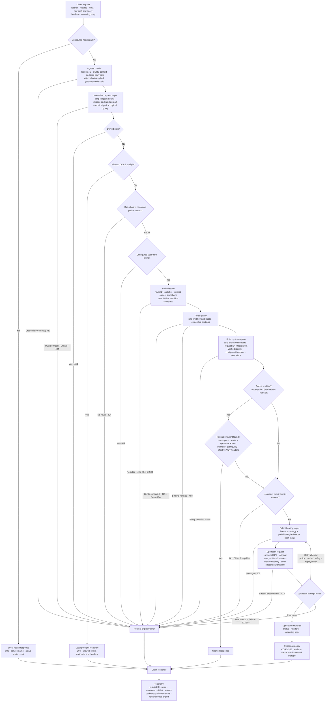

# Lagos — Rust API Gateway with JWT Authentication

[](https://github.com/lagos-sh/lagos/actions/workflows/ci.yml)
[](LICENSE)

**Lagos is an open-source API gateway and HTTP reverse proxy written in Rust,
built on [Pingora](https://github.com/cloudflare/pingora).** It verifies JWT and
Firebase ID tokens, applies declarative routing policies, and forwards verified
identity to upstream services through headers or signed tokens.

Lagos brings authentication, load balancing, response caching, rate limiting,
and observability into one gateway process. Configuration uses YAML; custom
request policies can be implemented as Rust extensions.

> [!IMPORTANT]
> **Early development, pre-1.0.** Lagos has not been deployed in production or
> validated through load or soak testing. Configuration may change without a
> deprecation period before 1.0. Evaluate it in development and test environments;
> it is not yet recommended for production traffic. See [Project status](#project-status).

## How Lagos handles a request

The diagram follows the runtime path from the client-visible HTTP request to a
local response, cached response, or selected upstream. Labels show the data
created or transformed at each stage.



All authorization decisions finish before cache lookup or upstream selection.
A cache hit therefore cannot bypass routing, authentication, rate limiting, or
ownership checks. The gateway records the final outcome in structured logs and
metrics; sampled requests also produce trace data.

## Contents

- [How Lagos handles a request](#how-lagos-handles-a-request)
- [Features](#features)
- [Quick start](#quick-start)
- [Configuration](#configuration)
- [Authentication and identity](#authentication-and-identity)
- [Traffic management](#traffic-management)
- [Observability](#observability)
- [CLI reference](#cli-reference)
- [Deployment](#deployment)
- [Architecture and extensions](#architecture-and-extensions)
- [Development and testing](#development-and-testing)
- [Contributing](#contributing)
- [Project status](#project-status)
- [Security](#security)
- [License](#license)

## Features

| Capability | What Lagos provides |
|---|---|
| JWT authentication | Verification against configured issuers and cached JWKS, with audience and algorithm checks |
| Firebase authentication | Firebase ID token verification across multiple projects using public signing certificates |
| Identity forwarding | Verified subject, issuer, mapped claims, and optional signed identity tokens for upstream services |
| Declarative routing | Path prefixes, host matching, allowed methods, authentication tiers, and internal route restrictions |
| Service-to-service access | Machine credentials on a separate internal listener |
| Load balancing | Weighted upstream pools with round robin, random, or consistent hashing and optional health checks |
| Traffic controls | Per-route rate limits, bounded retries, circuit breakers, request body limits, and configurable timeouts |
| Response caching | Opt-in memory cache with object limits, authorization checks, `Vary` handling, and route reload isolation |
| Streaming | Request and response streaming, including server-sent events (SSE) |
| Observability | Structured logs, Prometheus metrics, trace context propagation, and optional OTLP export |
| Developer tools | Configuration validation, route inspection, request explanation, and development reloads |
| Rust extensions | Custom request policies through the `lagos-core` library |

Lagos is designed for projects that want to centralize API authentication and
routing in front of HTTP services. Upstream applications can read gateway-issued
identity instead of integrating with every identity provider. They still need
to enforce their application-specific permissions and protect direct access to
endpoints that trust those headers.

## Quick start

### Prerequisites

- Rust and Cargo, with the toolchain specified in [rust-toolchain.toml](rust-toolchain.toml).
- A native build environment suitable for the dependencies; the [Dockerfile](Dockerfile)
  lists the tools used by the container build.
- An HTTP service exposing `/users` on `127.0.0.1:3000` to test proxy requests.

The gateway itself does not require a database, Redis, or a separate control plane.

### Install from source

```bash
git clone https://github.com/lagos-sh/lagos.git
cd lagos
cargo install --path crates/lagos --locked
```

Ensure Cargo's binary directory is on your `PATH`, then check the CLI:

```bash
lagos --help
```

### Create a gateway configuration

Save this complete example as `gateway.yml`:

```yaml
server:
  listen: 127.0.0.1:8080

upstreams:
  users: http://127.0.0.1:3000

routes:
  public:
    - prefix: /users
      upstream: users
      methods: [GET]
```

Validate the configuration and start the gateway:

```bash
lagos validate gateway.yml
lagos run gateway.yml
```

From another terminal:

```bash
curl http://127.0.0.1:8080/health
curl http://127.0.0.1:8080/users
```

`/health` reports gateway status. `/users` forwards to the configured service,
so its response depends on that service being available. The route prefix is
preserved: `/users/42` is forwarded as `/users/42`.

For a generated starter configuration, run `lagos init` in a directory without
an existing `gateway.yml`. See [examples/gateway.yml](examples/gateway.yml) for
additional configuration patterns.

## Configuration

The following YAML examples show settings to merge into `gateway.yml` unless
marked as complete configurations. Define every referenced service under
`upstreams`.

Configuration keys are validated, and unknown fields produce an error. Without
an explicit configuration path, the CLI checks `GATEWAY_CONFIG`, then
`gateway.yml`, `gateway.yaml`, and `config/gateway.yml`.

### Environment variables

Use `${VAR}` for a required value or `${VAR:-default}` for a fallback:

```yaml
upstreams:
  users: ${USERS_URL:-http://localhost:3000}

inject:
  headers:
    x-api-key: ${API_KEY}
```

An unset, empty, or whitespace-only required variable causes configuration
loading to fail. Write `$${` when a literal `${` is needed.

### Routes and authentication tiers

A route's group determines its authentication policy:

```yaml
routes:
  internal:
    - products/internal

  public:
    - prefix: /auth
      upstream: auth
      methods: [POST]

  optional:
    - prefix: /products
      upstream: products
      methods: [GET]

  authenticated:
    - prefix: /orders
      upstream: orders
```

| Group | No bearer token | Valid bearer token | Invalid or expired bearer token |
|---|---|---|---|
| `public` | Proxied without user identity | Token ignored by gateway authentication | Token ignored by gateway authentication |
| `optional` | Proxied anonymously | Proxied with verified identity | `401` |
| `authenticated` | `401` | Proxied with verified identity | `401` |
| `machine` | Requires a machine credential on the internal listener | User token does not establish machine identity | User token does not establish machine identity |

`internal` lists path prefixes denied on the public listener. It is not an
authentication tier. Denied and unallowlisted paths return the same `404`
response. Other refusals use the appropriate status, including `401` for user
authentication failures and `403` for ownership binding failures.

Path matching uses segment boundaries and the longest matching prefix within
host specificity. Omitting `methods` permits any method. Set `enabled: false`
to exclude a route from the active table.

### Host matching

```yaml
routes:
  public:
    - host: api.example.com
      prefix: /users
      upstream: users

    - host: ["*.preview.example.com", staging.example.com]
      prefix: /users
      upstream: users-staging
```

Routes without `host` match any host. Host-restricted routes take precedence
over unrestricted routes; matching ignores case and port. Wildcards require a
subdomain boundary, so `*.example.com` does not match `evilexample.com`.

Host matching selects routes; it does not authenticate callers. Restrict
internal access through the machine listener and network policy.

### Mount paths and route reloads

To serve both a versioned API prefix and paths at the root:

```yaml
server:
  mounts: [/api/v1, /]
```

The longest matching mount is removed before route matching. With the `/users`
route above, `/api/v1/users/42` and `/users/42` both forward as `/users/42`.

Routes can also live in a separate file:

```yaml
routes:
  file: routes.yml
  reload: 15s
```

The route file contains the route groups directly, without a `routes:` wrapper.
Use inline routes or a route file, not both. File changes are polled by
modification time; invalid route updates retain the previous table. Successful
reloads start a new cache namespace. Changes to the main configuration require
a restart, which `lagos dev` manages during development.

## Authentication and identity

### JWT authentication with JWKS

Configure the issuer, accepted audiences, signing key endpoint, and permitted
algorithms for each provider:

```yaml
auth:
  jwt:
    - issuer: https://auth.example.com
      audience: [my-api]
      jwks_url: https://auth.example.com/.well-known/jwks.json
      algorithms: [RS256]
      required_claims: [email]
```

Compatible JWT issuers can include Auth0, Microsoft Entra ID, Keycloak, Okta,
Amazon Cognito, or a custom identity provider. Use the issuer and JWKS URL
published for your application; endpoint paths vary by provider.

Lagos selects a configured verifier using the token's `iss` claim and then
verifies the signature and claims. Audience configuration is required. The
verifier checks expiration, requires a numeric `iat`, rejects an issuance time
beyond the configured clock skew, and validates `nbf` when present. Generic JWT
verification also requires a nonempty string `sub` and a signing-key `kid`.

The token's `alg` must appear in the configured algorithm list. Supported
algorithms are `RS256`, `RS384`, `RS512`, `ES256`, `ES384`, `PS256`, `PS384`,
`PS512`, and `EdDSA`. HMAC algorithms and `none` are not accepted for external
JWT verification. Duplicate issuer registrations fail startup.

Lagos verifies tokens issued elsewhere; it does not provide a login flow or
issue identity-provider access tokens.

### Firebase ID tokens

```yaml
auth:
  firebase:
    projects: [customer-prod, merchant-prod, staff-prod]
```

Firebase verification uses project IDs and Google's public signing
certificates. No service-account credentials or Firebase private keys are
needed. Checks include the signature, issuer, audience, expiration, issuance
time, authentication time, and subject. Token revocation is not checked.

Firebase and generic JWT providers can be configured together.

### Identity headers and signed tokens

After verification, Lagos describes the caller to the upstream:

```text
x-auth-subject: 4821
x-auth-issuer: https://securetoken.google.com/customer-prod
x-auth-claims: <base64url-encoded JSON claims>
```

Configured identity headers are stripped from client requests before gateway
values are set. Public routes receive no verified user identity.

For upstreams that also verify the gateway's assertion cryptographically,
configure a short-lived identity token:

```yaml
identity:
  token:
    header: x-auth-token
    secret: ${GATEWAY_IDENTITY_SECRET}
    ttl: 60s
    audience: internal

forward:
  authorization: false
```

The identity token uses `HS256`. Upstreams should verify its signature,
expiration, and configured audience with the shared identity secret.
`forward.authorization: false` stops forwarding the original caller credential;
its default is `true`.

### Claims and ownership

Map verified claims into individual headers:

```yaml
identity:
  claims:
    x-user-id: sub
    x-user-type: user_type
    x-employer-company-id:
      claim: employerCompanyId
      when_null: none
```

| Claim value | Forwarded header |
|---|---|
| String, number, or boolean | Scalar value |
| Explicit JSON `null` | `when_null`, if configured; otherwise omitted |
| Absent | Omitted |
| Object or array | Request refused when the claim is mapped to a header |

Ownership bindings compare a request value with the verified identity:

```yaml
routes:
  authenticated:
    - prefix: /events/orders
      upstream: realtime
      bind:
        query.merchantId: identity.company_id
```

Bindings support `query.<name>` and `header.<name>` sources, compared with
`identity.subject`, `identity.sub`, or a claim path. Missing values, mismatches,
and duplicate bound parameters or headers return `403`. Query names and values
are decoded before comparison. Bindings complement the upstream's own
application authorization.

### Machine authentication

Service-to-service routes use a separate listener and shared credential:

```yaml
server:
  internal_listen: 127.0.0.1:8081

auth:
  machine:
    secret: ${MACHINE_SECRET}
    headers: [x-internal-api-key]

routes:
  machine:
    - prefix: /jobs
      upstream: jobs
```

Machine routes are absent from the public listener. Restrict network access to
the internal listener. Use `inject.machine` to configure credentials sent to
machine-tier upstreams independently of the public listener's `inject.headers`.

## Traffic management

### Upstream pools

A single URL configures one target. Multiple targets configure a pool:

```yaml
upstreams:
  orders:
    targets:
      - http://orders-1:3000
      - url: http://orders-2:3000
        weight: 3
    balance: round_robin
    health_check:
      path: /health
      interval: 10s
      unhealthy_after: 2
      healthy_after: 1
```

Available balancing strategies are `round_robin`, `random`, and `consistent`.
Consistent hashing supports `hash_on: path`, `identity`, `ip`, or `header.<name>`;
`path` is the default. IP hashing uses the socket peer, which may be an ingress
rather than the original client.

Health checks use HTTP when `path` is configured and TCP otherwise. Unhealthy
members leave the selection pool and rejoin after successful checks. If no
healthy member can be selected, Lagos returns `502`.

Pool discovery resolves configured targets at startup. A target that cannot be
resolved prevents startup. Pool membership is static; DNS-based membership
refresh is not provided. Review service discovery requirements before using
pools with changing backend addresses.

### Retries

```yaml
routes:
  authenticated:
    - prefix: /orders
      upstream: orders
      retry:
        attempts: 2
        on: [connection_failure, transport_error]
```

`attempts` counts retries after the initial attempt.

| Failure | Retry policy |
|---|---|
| Connection failure before delivery | Any method, when enabled and replayable |
| Eligible transport failure after connection | Idempotent methods by default, subject to Pingora's retry decision |
| Body no longer replayable | No retry |
| Upstream response status | Status-based retries are not supported |

`non_idempotent: true` permits eligible transport retries for methods such as
`POST` and `PATCH`; use it only when the upstream tolerates duplicate delivery.
Pool selection runs again on retry, but selection of a different backend is
not guaranteed.

### Circuit breaker

```yaml
upstreams:
  orders:
    url: http://orders:3000
    circuit_breaker:
      failures: 5
      window: 30s
      cooldown: 10s
      successes_to_close: 2
      max_trials: 1
```

Circuit breakers track upstream failures and temporarily stop new upstream
attempts. A closed circuit opens after the configured failure run. Following
the cooldown, a limited number of half-open trials determine whether it closes
or opens again. Shed requests receive `503` with `Retry-After`.

Only requests that need an upstream consume trials. Cache hits and local
refusals, such as rate limiting, do not count as upstream recovery. Health
checks assess individual backend availability; circuit breakers track outcomes
for the logical upstream.

### Rate limiting

```yaml
routes:
  authenticated:
    - prefix: /search
      upstream: search
      rate_limit:
        requests: 100
        interval: 1m
        key: identity
        counter: exact
```

Limits are per route and local to each gateway process. Exceeding a limit
returns `429` with `Retry-After`. Multiple gateway instances do not share quota.
Available keys are `ip`, `identity`, `route`, and `header.<name>`. If a configured
key cannot be determined, that request is not limited; choose a key present on
all requests that must be covered.

| Counter | Behavior |
|---|---|
| `exact` | Per-key sliding-window counters in a capacity-bounded cache; default `max_keys` is 100,000 |
| `sketch` | Fixed-memory count-min sketch; collisions can over-count and refuse a request below its own quota |

For IP limits, configure `trusted_proxies` inside the route's `rate_limit`
block. `0` uses the socket peer; `1` uses the last `X-Forwarded-For` entry;
`n` counts from the right. This setting must match the actual trusted proxy
chain. An excessive value can trust a client-supplied address.

### Response cache

```yaml
cache:
  max_size: 256MiB
  max_object_size: 8MiB
  default_ttl: 60s

routes:
  public:
    - prefix: /products
      upstream: products
      methods: [GET, HEAD]
      cache: true
```

Caching is opt-in per route. Lagos uses Pingora's cache lifecycle with a custom
memory store. Storage and eviction accounting include metadata costs, and
object size is checked during filling. Only complete objects are stored;
oversized responses continue downstream without being cached.

| Condition | Cache behavior |
|---|---|
| `Cache-Control: private` or `no-store` | Not stored or reused |
| Request contains `Authorization` | Reuse and storage require explicit permission in the response cache policy |
| Method other than `GET` or `HEAD`, or an SSE route | Bypasses caching |
| `Vary: *` or malformed `Vary` | Not reusable |
| Route has no `cache: true` | Bypasses caching |
| `4xx` or `5xx` without explicit caching instructions | Not cached by default |

An `optional` or `authenticated` route also requires
`cache_authenticated: true` to enable caching. This opt-in assumes the upstream
provides correct cache directives for personalized content.

Keys include host, method, path, query, route, upstream, and route table
generation. `Vary` selects variants using headers sent upstream, including
injected identity. A successful route reload starts a fresh namespace; old
entries remain subject to eviction.

### CORS

```yaml
cors:
  origins: [https://app.example.com, "https://*.preview.example.com"]
  methods: [GET, POST]
  headers: [content-type, authorization]
  expose: [x-request-id]
  credentials: true
  max_age: 10m
```

Lagos answers eligible preflight requests after route and deny-list checks,
before user authentication. Origin rules match the scheme, host, and port.
`credentials: true` with origin `*` fails configuration validation. Responses
that echo an allowed origin add `Vary: Origin` while preserving upstream
`Vary` fields.

### Streaming and request limits

Set `sse: true` on an SSE route to use the SSE timeout and emit headers that
request intermediaries avoid response buffering. SSE routes bypass the cache.

`limits.max_body` applies to declared content lengths and streamed request body
bytes. Oversized requests return `413`. The `timeouts` block controls connection,
normal request, upload, SSE, and upstream idle timeouts. See the
[configuration types](crates/lagos-core/src/config/mod.rs) for fields and defaults.

## Observability

### Metrics

Expose Prometheus metrics on a separate listener:

```yaml
observability:
  metrics:
    listen: 127.0.0.1:9090
```

| Metric | Purpose |
|---|---|
| `gateway_requests_total` | Request counts by route, method, and status |
| `gateway_request_duration_seconds` | Request latency by route |
| `gateway_rejections_total` | Gateway refusals by event and normalized reason |
| `gateway_upstream_errors_total` | Upstream errors |
| `gateway_retries_total` | Retry attempts |
| `gateway_pool_backends` | Healthy and unhealthy backend counts |
| `gateway_circuit_state` | Closed (`0`), half-open (`1`), or open (`2`) |
| `gateway_cache_total` | Cache outcomes by route |
| `gateway_spans_dropped_total` | Trace spans dropped from the export queue |
| `gateway_routes` | Configured route count |

Metric labels use configured identifiers or bounded categories. Request paths,
token subjects, and raw rejection details are not used as metric labels. Keep
the metrics listener accessible only to the intended monitoring infrastructure.

### Tracing

```yaml
observability:
  tracing:
    sample_ratio: 0.1
    otlp:
      endpoint: http://otel-collector:4318/v1/traces
```

Lagos continues incoming `traceparent` context with a new span for the gateway
hop. Missing or malformed context starts a new trace. `sample_ratio` applies to
new traces; incoming sampling decisions are preserved.

Omit `otlp` to propagate trace context without exporting spans. Export uses a
bounded, nonblocking queue; a full queue drops spans and records a metric rather
than waiting on the collector in the request path.

### Logging

Serving mode emits structured logs with request ID, route, upstream, response
status, latency, and retry information. `lagos dev` provides readable request
narration for local debugging. Lagos suppresses duplicate Pingora proxy error
logs and emits its own contextual failure records.

## CLI reference

| Command | Purpose |
|---|---|
| `lagos init [PATH]` | Generate a starter configuration; defaults to `gateway.yml` |
| `lagos validate [CONFIG]` | Validate configuration, routes, and extension references |
| `lagos routes [CONFIG]` | Display routes and upstreams |
| `lagos explain --path PATH [--method METHOD] [--host HOST] [--config CONFIG]` | Explain routing and configured policy without serving traffic |
| `lagos dev [CONFIG]` | Serve with request narration and validated configuration reloads |
| `lagos run [CONFIG]` | Start the gateway |

For example:

```bash
lagos explain --method GET --host api.example.com --path /users/42
```

Use `lagos --help` or `lagos <command> --help` for command options. Running
`lagos` without a subcommand starts serving with the discovered configuration.

## Deployment

### Docker

Build the image from the repository:

```bash
docker build -t lagos:local .
```

Use a deployment configuration that listens on `0.0.0.0:8080` and points to
upstream addresses reachable from inside the container. The quick-start
loopback addresses are intended for a native local process.

```bash
docker run --rm -p 8080:8080 \
  --mount "type=bind,src=$(pwd)/gateway.yml,dst=/app/gateway.yml,readonly" \
  lagos:local
```

The image uses a distroless Debian runtime and runs as a nonroot user. Pass any
required configuration environment variables to the container. Mount separate
route files at their configured paths when using file-based routes.

### Listeners and graceful shutdown

The stock binary exposes HTTP listeners. Terminate public TLS at an ingress or
another proxy and restrict direct access to upstreams that trust injected
identity. HTTPS upstream targets are supported.

`server.graceful_shutdown` defaults to `25s`. Configure the surrounding process
manager or Kubernetes termination grace period to allow that drain to finish.
Keep internal and metrics listeners restricted to their intended networks.

## Architecture and extensions

### Request lifecycle

1. Answer the health endpoint locally, or check gateway-owned client
   credentials and the declared request body size.
2. Remove the matching mount and canonicalize the path.
3. Apply the deny-list, then match an allowed route and method.
4. Verify user or machine credentials required by the route.
5. Apply rate limits, ownership bindings, identity policy, and extensions.
6. Check cache eligibility and reuse a matching response when permitted.
7. Check the circuit, select an upstream, apply the header plan, and proxy.

Authorization decisions are centralized in `request_filter`. Availability
checks occur when an upstream is needed. Incoming headers use allowlist
forwarding by default, with structural headers retained and gateway-controlled
values applied explicitly. `forward.mode: passthrough` is an explicit alternative.

### Path canonicalization

Lagos decodes percent-encoded paths before authorization, rejects dot segments,
backslashes, control characters, and unresolved percent escapes, then re-encodes
path segments for forwarding. The same canonical path is used for route policy
and upstream request construction. See [path.rs](crates/lagos-core/src/path.rs).

### Repository layout

| Path | Purpose |
|---|---|
| [`crates/lagos`](crates/lagos) | Stock CLI and gateway binary |
| [`crates/lagos-core`](crates/lagos-core) | Gateway library and policy implementation |
| [`crates/lagos-core/src/auth`](crates/lagos-core/src/auth) | JWT, Firebase, and signing-key verification |
| [`crates/lagos-core/src/routes`](crates/lagos-core/src/routes) | Routing, listener partitioning, and route providers |
| [`crates/lagos-core/src/cache`](crates/lagos-core/src/cache) | Cache policy, storage, and memory accounting |
| [`examples/gateway.yml`](examples/gateway.yml) | Configuration examples |
| [`tests/e2e`](tests/e2e) | Local upstream fixtures and integration checks |
| [`SECURITY.md`](SECURITY.md) | Vulnerability reporting policy |

### Extensions

Custom gateway binaries link `lagos-core`, implement the
[`Extension` trait](crates/lagos-core/src/ext.rs), and register extensions before
calling the CLI or runtime. The stock binary has no custom extensions registered.

Routes refer to registered extensions by name:

```yaml
routes:
  authenticated:
    - prefix: /pos
      upstream: pos
      extensions: [pos-actor-context]
```

An extension can inspect verified identity and construct a header plan:

```rust
use async_trait::async_trait;
use lagos_core::{Extension, ExtensionContext, Rejection};

struct PosActorContext;

#[async_trait]
impl Extension for PosActorContext {
    fn name(&self) -> &'static str {
        "pos-actor-context"
    }

    async fn on_request(&self, cx: &mut ExtensionContext<'_>) -> Result<(), Rejection> {
        let subject = cx.require_identity()?.subject.clone();
        cx.plan.set("x-cashier-user-id", subject);
        Ok(())
    }
}
```

`plan.set()` replaces any client-supplied copy of that header. Missing extension
registrations fail startup; requests referencing an unavailable extension fail
closed.

### Route providers

The [`RouteProvider` trait](crates/lagos-core/src/routes/mod.rs) supplies route
tables independently of the proxy lifecycle. Lagos includes inline and YAML
file providers. Custom providers can integrate other configuration sources;
a Kubernetes `Ingress` or `HTTPRoute` controller is not included.

## Development and testing

Run the gateway directly from the checkout:

```bash
cargo run --bin lagos -- validate gateway.yml
cargo run --bin lagos -- dev gateway.yml
```

Run the checks used by [CI](.github/workflows/ci.yml):

```bash
cargo fmt --all -- --check
cargo clippy --workspace --all-targets -- -D warnings
cargo test --workspace
cargo check -p lagos-core --no-default-features
./tests/e2e/run.sh
```

The end-to-end suite requires Bash, Python 3, OpenSSL, curl, and a local build
environment. It starts local gateway, identity-provider, and upstream fixtures;
the full suite also runs [regressions.py](tests/e2e/regressions.py).

Coverage includes token forgery, path traversal, route isolation, duplicate
ownership parameters, cache variants and authorization, memory accounting,
retry behavior, circuit recovery, health checks, SSE streaming, and hot reloads.

The `lagos-core` library enables the `cache` and `otel` features by default.
Custom binaries can disable its default features and opt into either feature
individually. The stock `lagos` crate uses the library's default features.

## Contributing

Bug reports, documentation improvements, regression tests, and implementation
changes are welcome.

1. For non-security bugs, open an [issue](https://github.com/lagos-sh/lagos/issues)
   with a minimal reproduction, expected behavior, observed behavior, and a
   configuration with secrets removed.
2. Keep changes focused and add regression coverage for behavior changes.
3. Run the checks in [Development and testing](#development-and-testing).
4. Open a [pull request](https://github.com/lagos-sh/lagos/pulls) explaining the
   change and how it was validated.

Use the private reporting process below for suspected vulnerabilities.

## Project status

Lagos is an early-stage, pre-1.0 project. The current test suites include 239
unit tests, 129 end-to-end cases, and 38 additional regression checks. These
checks verify specific behavior; they do not establish production readiness.

- No production deployment has been reported by the project.
- Load and soak testing have not been completed; no throughput or latency
  benchmark claims are made.
- The configuration format may change without a deprecation period before 1.0.
- Memory limits are covered by implementation checks and tests, but have not
  been validated under sustained production traffic.

## Security

Report suspected vulnerabilities privately through
[GitHub security advisories](https://github.com/lagos-sh/lagos/security/advisories/new).
Do not include exploit details or credentials in public issues.

Read [SECURITY.md](SECURITY.md) for scope, supported versions, response
expectations, and disclosure policy. During pre-1.0 development, only `main`
is supported.

## License

Lagos is licensed under the [Apache License 2.0](LICENSE).
